# gen_sql SQL生成完整流程文档

## 目录
- [概述](#概述)
- [流程图](#流程图)
- [详细流程](#详细流程)
  - [阶段1：Parser - 问题解析](#阶段1parser---问题解析)
  - [阶段2：Retriever - 候选表检索](#阶段2retriever---候选表检索)
  - [阶段3：Planner - JOIN路径规划](#阶段3planner---join路径规划)
  - [阶段4：Generator - SQL生成](#阶段4generator---sql生成)
- [数据流转示例](#数据流转示例)

## 概述

gen_sql 的 SQL 生成流程采用四阶段架构，通过 Orchestrator 协调 Parser、Retriever、Planner、Generator 四个 Agent，将自然语言问题转换为可执行的 SQL 查询。

**核心组件：**
- **Orchestrator（协调器）**: 串联四个阶段，传递上下文
- **Parser（解析器）**: 结构化问题，提取时间、指标、维度
- **Retriever（检索器）**: 查询语义向量库和维度值索引，获取候选表
- **Planner（规划器）**: 选择基表，查询 Neo4j 获取 JOIN 路径
- **Generator（生成器）**: 拼接上下文，调用 LLM 生成最终 SQL

---

## 流程图

```mermaid
graph TB
    Start([用户问题]) --> Parser
    
    subgraph "阶段1: Parser - 问题解析"
        Parser[Parser Agent] --> P1[构建 Parser Prompt]
        P1 --> P2[调用 LLM]
        P2 --> P3[解析输出 JSON]
        P3 --> ParseResult[QueryParseResult<br/>- keywords<br/>- time<br/>- metric<br/>- dimensions<br/>- intent<br/>- signals]
    end
    
    ParseResult --> Retriever
    
    subgraph "阶段2: Retriever - 候选表检索"
        Retriever[Retriever Agent] --> R1{解析结果中的维度}
        
        R1 -->|维度值 role=value| R2[search_dim_values_tool<br/>查询 system.dim_value_index]
        R1 -->|维度名 role=column| R3[search_semantic_columns_tool<br/>查询 system.sem_object_vec]
        R1 -->|指标 metric| R3
        
        R2 --> R4[dim_value_hits<br/>维度值命中]
        R3 --> R5[column_hits<br/>列命中]
        
        Retriever --> R6[search_semantic_objects_tool<br/>原始问题语义检索<br/>查询 system.sem_object_vec]
        R6 --> R7[semantic_hits<br/>- tables<br/>- columns]
        
        R4 --> R8[合并与去重]
        R5 --> R8
        R7 --> R8
        
        R8 --> R9[提取候选表]
        R9 --> R10[路径1: 从 dim_value_hits<br/>提取维度表]
        R9 --> R11[路径2: 从 column parent_id<br/>提取表并分类]
        R9 --> R12[路径3: 从语义表检索<br/>提取事实表和维度表]
        
        R10 --> CandidateSet
        R11 --> CandidateSet
        R12 --> CandidateSet
        
        CandidateSet[CandidateSet<br/>- candidate_fact_tables<br/>- candidate_dim_tables<br/>- dim_value_hits<br/>- semantic_hits<br/>- table_similarities]
    end
    
    CandidateSet --> Planner
    
    subgraph "阶段3: Planner - JOIN路径规划"
        Planner[Planner Agent] --> PL1{候选表类型判断}
        
        PL1 -->|有事实表| PL2[选择事实表作为 base]
        PL1 -->|无事实表<br/>仅维度表| PL3[维度表优化分析]
        
        PL3 --> PL4{维度表数量}
        PL4 -->|单个维度表| PL5[直接返回单表计划<br/>跳过 Neo4j 查询]
        PL4 -->|多个维度表| PL6[连通性分析<br/>选择连接数最多的维度表]
        
        PL2 --> PL7{是否需要 JOIN}
        PL6 --> PL7
        
        PL7 -->|仅一个表| PL8[返回单表计划<br/>targets=空, edges=空]
        PL7 -->|多个表| PL9[plan_join_path_tool<br/>查询 Neo4j]
        
        PL9 --> PL10[Neo4j.plan_join_paths<br/>base → targets]
        PL10 --> PL11[获取 JOIN 边<br/>- src_table<br/>- dst_table<br/>- on<br/>- join_type<br/>- cardinality]
        
        PL11 --> JoinPlans
        PL5 --> JoinPlans
        PL8 --> JoinPlans
        
        JoinPlans[JoinPlan列表<br/>- base<br/>- targets<br/>- edges]
    end
    
    JoinPlans --> Generator
    
    subgraph "阶段4: Generator - SQL生成"
        Generator[Generator Agent] --> G1[收集所有涉及的表ID]
        G1 --> G2[fetch_table_cards_tool<br/>查询 system.sem_object_vec<br/>获取表结构卡片]
        
        G2 --> G3[构建 ContextEnvelope<br/>- question<br/>- parse<br/>- candidates<br/>- join_plans<br/>- table_cards]
        
        G3 --> G4[格式化上下文]
        G4 --> G5[维度值优化<br/>optimize_dim_value_filter]
        G5 --> G6[拼接表结构描述]
        G6 --> G7[拼接 JOIN 计划]
        G7 --> G8[提取时间列提示]
        
        G8 --> G9[build_generator_prompt<br/>构建完整提示词]
        G9 --> G10[调用 LLM<br/>生成 SQL]
        
        G10 --> SQL
    end
    
    SQL([最终 SQL]) --> End([返回结果])
    
    style Start fill:#e1f5ff
    style SQL fill:#c8e6c9
    style End fill:#c8e6c9
    style Parser fill:#fff9c4
    style Retriever fill:#ffe0b2
    style Planner fill:#f8bbd0
    style Generator fill:#d1c4e9
```



---

## 详细流程

### 阶段1：Parser - 问题解析

#### 目标
将自然语言问题解析为结构化的 `QueryParseResult` 对象，提取关键要素。

#### 实现逻辑

**文件位置：**
- Agent: `gen_sql/agent/agents/parser.py`
- Tool: `gen_sql/agent/tools/parse_query_tool.py`
- Prompt: `gen_sql/agent/prompts/parser_prompt.py`

**执行步骤：**

1. **获取当前日期**
   ```python
   # 使用 Asia/Shanghai 时区
   tz = pytz.timezone("Asia/Shanghai")
   current_date = datetime.now(tz).strftime("%Y-%m-%d")
   # 示例：2024-01-15
   ```

2. **构建提示词**
   
   **System Prompt：**
   ```
   You are a Chinese business intelligence analyst who extracts structured intents 
   from natural language questions.
   Follow these rules strictly:
   1. **IMPORTANT**: Time field handling:
      - If the question does NOT explicitly mention any time constraint, the time field MUST be null.
      - Do NOT infer, guess, or create default time ranges when no time is mentioned.
      - Only when time is explicitly stated, use Asia/Shanghai timezone and return 
        ISO-8601 dates with a half-open interval [start, end).
   2. Always emit valid JSON that matches the QueryParseResult schema.
   3. Classify each dimension as either a column name candidate (column) or a literal value (value).
   4. Supported intents: plain_agg, topn, rank, compare_yoy, compare_mom.
   5. Ensure dimensions is an array and preserve the original Chinese text.
   ```

   **User Prompt 模板：**
   ```
   今天的日期是: {current_date} (Asia/Shanghai 时区)
   
   请分析下述问题, 给出严格 JSON 输出。
   问题: {question}
   JSON schema:
   {
     "keywords": [str],
     "time": {"start": "YYYY-MM-DD", "end": "YYYY-MM-DD", "grain_inferred": str, "is_full_period": bool} | null,
     "metric": {"text": str, "is_aggregate_candidate": bool},
     "dimensions": [{"text": str, "role": "column|value", "evidence": str}],
     "intent": {"task": "plain_agg|topn|rank|compare_yoy|compare_mom", "topn": int|null},
     "signals": [str]
   }
   
   注意: 
   - time 字段仅在问题中明确提及时间约束时才填充具体值, 否则必须为 null。
   - 对于相对时间表述（如"最近一个月"、"上个月"、"昨天"、"今年"等），
     请基于今天的日期 {current_date} 来推断具体的时间范围。
   - 不要推测或添加问题中未提及的时间范围。
   
   输出要求: 仅输出 JSON, 不要额外说明。
   ```

3. **调用 LLM**
   ```python
   client = LLMClient()
   messages = [
       {"role": "system", "content": PARSER_SYSTEM_PROMPT},
       {"role": "user", "content": user_prompt}
   ]
   response = client.chat(messages, response_format={"type": "json_object"})
   ```

4. **解析并验证输出**
   ```python
   payload = ensure_json(response)
   result = QueryParseResult.model_validate(payload)
   ```

#### 输出样例

**示例问题1：**"上个月京东便利店的销售额是多少？"

```json
{
  "keywords": ["销售额", "京东便利店"],
  "time": {
    "start": "2024-01-01",
    "end": "2024-02-01",
    "grain_inferred": "monthly",
    "is_full_period": true
  },
  "metric": {
    "text": "销售额",
    "is_aggregate_candidate": true
  },
  "dimensions": [
    {
      "text": "京东便利店",
      "role": "value",
      "evidence": "明确的店铺类型值"
    }
  ],
  "intent": {
    "task": "plain_agg",
    "topn": null
  },
  "signals": ["aggregation", "time_filter"]
}
```

**示例问题2：**"有多少个店铺？"

```json
{
  "keywords": ["店铺", "数量"],
  "time": null,
  "metric": {
    "text": "数量",
    "is_aggregate_candidate": true
  },
  "dimensions": [
    {
      "text": "店铺",
      "role": "column",
      "evidence": "查询维度"
    }
  ],
  "intent": {
    "task": "plain_agg",
    "topn": null
  },
  "signals": ["count_query", "dimension_only"]
}
```

**示例问题3：**"北京地区销售额前10的店铺"

```json
{
  "keywords": ["销售额", "店铺", "北京"],
  "time": null,
  "metric": {
    "text": "销售额",
    "is_aggregate_candidate": true
  },
  "dimensions": [
    {
      "text": "北京",
      "role": "value",
      "evidence": "地区限定值"
    },
    {
      "text": "店铺",
      "role": "column",
      "evidence": "分组维度"
    }
  ],
  "intent": {
    "task": "topn",
    "topn": 10
  },
  "signals": ["ranking", "regional_filter"]
}
```

---

### 阶段2：Retriever - 候选表检索

#### 目标
基于解析结果，从多个数据源检索候选表和列，构建 `CandidateSet`。

#### 实现逻辑

**文件位置：**
- Agent: `gen_sql/agent/agents/retriever.py`
- Tools: 
  - `gen_sql/agent/tools/search_dim_values_tool.py`
  - `gen_sql/agent/tools/search_semantic_columns_tool.py`
  - `gen_sql/agent/tools/search_semantic_objects_tool.py`

**执行步骤：**

#### 步骤 2.1：维度值搜索

**触发条件：** `parse_result.dimensions` 中存在 `role="value"` 的维度

**实现：**
```python
def _search_dimensions(parse_result: QueryParseResult) -> List[Dict]:
    hits = []
    for idx, dimension in enumerate(parse_result.dimensions):
        if dimension.role != "value":
            continue
        text_value = dimension.text.strip()
        if not text_value:
            continue
        
        # 调用维度值搜索工具
        res = search_dim_values_tool(text_value)
        raw_hits = res.get("dim_value_hits", []) or []
        
        # 标注来源维度索引（用于后续替换）
        for h in raw_hits:
            h["source_text"] = dimension.text
            h["source_index"] = idx
            hits.append(h)
    
    return _deduplicate_hits(hits)
```

**数据库查询：**
```sql
-- 在 PostgreSQLClient.search_dim_values 中执行
SELECT 
    dim_table,
    dim_col,
    key_value,
    value_text,
    word_similarity(value_norm, norm_zh(%s)) AS score
FROM system.dim_value_index
WHERE value_norm %> norm_zh(%s)
ORDER BY score DESC
LIMIT %s;
```

**输出示例：**
```json
[
  {
    "dim_table": "public.dim_store",
    "dim_col": "store_type_name",
    "key_value": "101",
    "value_text": "京东便利",
    "score": 0.857,
    "source_text": "京东便利店",
    "source_index": 0
  }
]
```

#### 步骤 2.2：列语义搜索

**触发条件：** 
- `parse_result.dimensions` 中存在 `role="column"` 的维度
- `parse_result.metric` 有值

**实现：**
```python
def _search_columns(parse_result: QueryParseResult) -> List[Dict]:
    texts_to_search = []
    
    # 收集维度列名
    for dimension in parse_result.dimensions:
        text = dimension.text.strip()
        if dimension.role == "column" and text:
            texts_to_search.append({
                "text": text, 
                "source_type": "dimension"
            })
    
    # 收集指标名
    metric = parse_result.metric or {}
    metric_text = str(metric.get("text", "")).strip()
    if metric_text:
        texts_to_search.append({
            "text": metric_text, 
            "source_type": "metric"
        })
    
    hits = []
    for item in texts_to_search:
        results = search_semantic_columns_tool(item["text"]) or []
        for result in results:
            enriched = dict(result)
            enriched["source_type"] = item["source_type"]
            enriched["source_text"] = item["text"]
            hits.append(enriched)
    
    return hits
```

**工具实现：**
```python
# search_semantic_columns_tool
def search_semantic_columns_tool(text: str, topk: Optional[int] = None) -> List[Dict]:
    query = text.strip()
    agent_cfg = load_agent_config()
    topk_columns = int(topk or agent_cfg.retrieve.topk_columns)  # 默认 10
    threshold = agent_cfg.retrieve.similarity_threshold  # 默认 0.45
    
    # 生成查询向量
    client = _get_embedding_client()
    embedding = client.embed([query])[0]
    
    # 查询列向量
    with PostgreSQLClient() as pg:
        raw_columns = pg.search_semantic_columns(embedding, topk=topk_columns)
    
    # 过滤和标准化
    columns = [row for row in raw_columns if row.get("object_id")]
    if threshold:
        columns = [row for row in columns 
                   if row.get("similarity") is None or row["similarity"] >= threshold]
    
    return columns
```

**数据库查询：**
```sql
-- 在 PostgreSQLClient.search_semantic_columns 中执行
SELECT 
    object_id,
    text_raw,
    attrs,
    1 - (embedding <=> %s::vector) AS similarity,
    (attrs->>'table_category') AS parent_category,
    CASE 
        WHEN object_id ~ '^[^.]+\.[^.]+\.[^.]+$' 
        THEN regexp_replace(object_id, '\.[^.]+$', '')
        ELSE NULL 
    END AS parent_id
FROM system.sem_object_vec
WHERE object_type = 'column'
ORDER BY embedding <=> %s::vector
LIMIT %s;
```

**输出示例：**
```json
[
  {
    "object_id": "public.fact_store_sales_day.amount",
    "text_raw": "amount：销售金额；度量字段。示例值：1234.56",
    "similarity": 0.912,
    "parent_id": "public.fact_store_sales_day",
    "table_category": "事实表",
    "source_type": "metric",
    "source_text": "销售额"
  },
  {
    "object_id": "public.dim_store.store_name",
    "text_raw": "store_name：店铺名称。示例值：王府井店, 西单店",
    "similarity": 0.723,
    "parent_id": "public.dim_store",
    "table_category": "维度表",
    "source_type": "dimension",
    "source_text": "店铺"
  }
]
```

#### 步骤 2.3：语义对象搜索

**触发条件：** 始终执行

**实现：**
```python
def _build_semantic_query(question: str, parse_result: QueryParseResult) -> str:
    return question.strip()

semantic_query = _build_semantic_query(question, parse_result)
semantic = search_semantic_objects_tool(semantic_query)
```

**工具实现：**
```python
def search_semantic_objects_tool(text: str) -> Dict[str, object]:
    agent_cfg = load_agent_config()
    threshold = agent_cfg.retrieve.similarity_threshold
    topk_tables = agent_cfg.retrieve.topk_tables  # 默认 10
    topk_columns = agent_cfg.retrieve.topk_columns  # 默认 10
    
    # 生成查询向量
    client = _get_embedding_client()
    embedding = client.embed([text.strip()])[0]
    
    # 并行查询表和列
    with PostgreSQLClient() as pg:
        raw_tables = pg.search_semantic_tables(embedding, topk=topk_tables)
        raw_columns = pg.search_semantic_columns(embedding, topk=topk_columns)
    
    # 过滤低相似度结果
    tables = [row for row in raw_tables if row.get("object_id")]
    columns = [row for row in raw_columns if row.get("object_id")]
    if threshold:
        tables = [row for row in tables 
                  if row.get("similarity") is None or row["similarity"] >= threshold]
        columns = [row for row in columns 
                   if row.get("similarity") is None or row["similarity"] >= threshold]
    
    # 分类表为事实表和维度表
    classification = _classify_tables(tables)
    
    # 构建相似度字典
    table_similarities = {
        str(row.get("object_id")).strip(): float(row.get("similarity"))
        for row in tables if row.get("object_id") and row.get("similarity") is not None
    }
    
    return {
        "semantic_hits": {"tables": tables, "columns": columns},
        "candidate_fact_tables": classification["candidate_fact_tables"],
        "candidate_dim_tables": classification["candidate_dim_tables"],
        "table_similarities": table_similarities
    }
```

**数据库查询（表）：**
```sql
-- 在 PostgreSQLClient.search_semantic_tables 中执行
SELECT 
    object_id,
    text_raw,
    attrs,
    1 - (embedding <=> %s::vector) AS similarity,
    (attrs->>'category') AS table_category
FROM system.sem_object_vec
WHERE object_type = 'table'
ORDER BY embedding <=> %s::vector
LIMIT %s;
```

**输出示例：**
```json
{
  "semantic_hits": {
    "tables": [
      {
        "object_id": "public.fact_store_sales_day",
        "text_raw": "public.fact_store_sales_day（店铺销售日流水事实表）：按日汇总数据...",
        "similarity": 0.856,
        "table_category": "事实表"
      },
      {
        "object_id": "public.dim_store",
        "text_raw": "public.dim_store（店铺维度表）：主键 (store_id)...",
        "similarity": 0.789,
        "table_category": "维度表"
      }
    ],
    "columns": [...]
  },
  "candidate_fact_tables": ["public.fact_store_sales_day"],
  "candidate_dim_tables": ["public.dim_store"],
  "table_similarities": {
    "public.fact_store_sales_day": 0.856,
    "public.dim_store": 0.789
  }
}
```

#### 步骤 2.4：候选表汇总与去重

**实现：**
```python
def _handler(question: str, parse_result: QueryParseResult) -> CandidateSet:
    # 执行三个检索步骤
    dim_hits = _search_dimensions(parse_result)
    column_hits = _search_columns(parse_result)
    semantic = search_semantic_objects_tool(question)
    
    # 合并列检索结果
    semantic_hits = semantic.get("semantic_hits", {}) or {}
    merged_columns = (semantic_hits.get("columns") or []) + column_hits
    semantic_hits["columns"] = merged_columns
    
    # 路径1: 从维度值查找中提取维度表
    dim_tables_from_values = set()
    for hit in dim_hits:
        table_name = hit.get("dim_table")
        if table_name:
            table_str = str(table_name).strip()
            if "." not in table_str:
                table_str = f"public.{table_str}"
            dim_tables_from_values.add(table_str)
    
    # 路径2: 从列parent_id提取表（通过table_category分类）
    tables_from_columns = _extract_tables_from_columns(merged_columns)
    fact_from_columns = []
    dim_from_columns = []
    for table_info in tables_from_columns:
        table_name = table_info["table_id"]
        category = table_info.get("category") or "dimension"
        if category == "fact":
            fact_from_columns.append(table_name)
        else:
            dim_from_columns.append(table_name)
    
    # 路径3: 从语义表检索
    semantic_fact_tables = semantic.get("candidate_fact_tables", [])
    semantic_dim_tables = semantic.get("candidate_dim_tables", [])
    
    # 合并并去重
    all_fact_tables = semantic_fact_tables + fact_from_columns
    final_fact_tables = list(dict.fromkeys(all_fact_tables))
    
    all_dim_tables = (list(dim_tables_from_values) + 
                      dim_from_columns + 
                      semantic_dim_tables)
    final_dim_tables = list(dict.fromkeys(all_dim_tables))
    
    # 构建 CandidateSet
    payload = {
        "dim_value_hits": dim_hits,
        "semantic_hits": semantic_hits,
        "candidate_fact_tables": final_fact_tables,
        "candidate_dim_tables": final_dim_tables,
        "table_similarities": semantic.get("table_similarities", {}),
        "constraints": {}
    }
    return CandidateSet.model_validate(payload)
```

#### 输出样例

**完整的 CandidateSet：**
```json
{
  "dim_value_hits": [
    {
      "dim_table": "public.dim_store",
      "dim_col": "store_type_name",
      "key_value": "101",
      "value_text": "京东便利",
      "score": 0.857,
      "source_text": "京东便利店",
      "source_index": 0
    }
  ],
  "semantic_hits": {
    "tables": [
      {
        "object_id": "public.fact_store_sales_day",
        "similarity": 0.856
      },
      {
        "object_id": "public.dim_store",
        "similarity": 0.789
      }
    ],
    "columns": [
      {
        "object_id": "public.fact_store_sales_day.amount",
        "similarity": 0.912,
        "parent_id": "public.fact_store_sales_day"
      },
      {
        "object_id": "public.dim_store.store_name",
        "similarity": 0.723,
        "parent_id": "public.dim_store"
      }
    ]
  },
  "candidate_fact_tables": [
    "public.fact_store_sales_day"
  ],
  "candidate_dim_tables": [
    "public.dim_store"
  ],
  "table_similarities": {
    "public.fact_store_sales_day": 0.856,
    "public.dim_store": 0.789
  },
  "constraints": {}
}
```

---

### 阶段3：Planner - JOIN路径规划

#### 目标
根据候选表集合，选择合适的基表（base），并从 Neo4j 查询 JOIN 路径。

#### 实现逻辑

**文件位置：**
- Agent: `gen_sql/agent/agents/planner.py`
- Tool: `gen_sql/agent/tools/plan_join_path_tool.py`
- Neo4j Client: `gen_sql/agent/db/neo4j_client.py`

**执行步骤：**

#### 步骤 3.1：判断是否可以只用维度表

**优化场景：**
- 对于"有多少个店铺？"这类纯维度计数查询
- 避免不必要的事实表 JOIN

**判断规则：**
```python
def _should_use_dimension_only(
    parse_result: QueryParseResult,
    candidate_fact_tables: List[str],
    candidate_dim_tables: List[str],
    table_similarities: Dict[str, float],
) -> Tuple[bool, Optional[str]]:
    """
    判断规则：
    1. 如果有时间约束，通常需要事实表（维度表一般不含时间字段）
    2. 如果没有维度表候选，无法使用维度表
    3. 如果没有事实表候选：
       - 只有一个维度表：直接使用
       - 多个维度表：需要通过 Neo4j 判断关系
    4. 如果维度表相似度明显高于事实表（差距 > threshold）：
       - 只有一个维度表：直接使用
       - 多个维度表：需要通过 Neo4j 规划关联路径
    """
    
    # 规则 1: 有时间约束，需要事实表
    if parse_result.time:
        return False, None
    
    # 规则 2: 没有维度表候选
    if not candidate_dim_tables:
        return False, None
    
    # 规则 3: 纯维度表场景
    if not candidate_fact_tables:
        if len(candidate_dim_tables) == 1:
            # 只有一个维度表，直接使用
            return True, candidate_dim_tables[0]
        else:
            # 多个维度表，需要通过 Neo4j 判断关系
            return False, None
    
    # 规则 4: 相似度差异判断
    best_dim_table, best_dim_sim = max(
        [(t, table_similarities.get(t, 0)) for t in candidate_dim_tables],
        key=lambda x: x[1]
    )
    best_fact_table, best_fact_sim = max(
        [(t, table_similarities.get(t, 0)) for t in candidate_fact_tables],
        key=lambda x: x[1]
    )
    
    agent_cfg = load_agent_config()
    similarity_gap_threshold = agent_cfg.planner.dim_only_gap_threshold  # 默认 0.05
    
    if best_dim_sim > best_fact_sim + similarity_gap_threshold:
        if len(candidate_dim_tables) == 1:
            # 相似度差距足够大且只有一个维度表
            return True, best_dim_table
        else:
            # 多个维度表，需要通过 Neo4j 规划关联路径
            return False, None
    
    return False, None
```

#### 步骤 3.2：选择 base 表

**有事实表的情况：**
```python
if fact_tables:
    base = force_base or _pick_base_table(fact_tables, preferred_base=preferred_base)
```

**只有维度表的情况（连通性分析）：**
```python
elif dim_tables:
    best_base = None
    best_path_map = None
    max_connections = -1
    best_similarity = 0.0
    
    # 尝试每个维度表作为 base
    with Neo4jClient() as neo4j:
        for candidate_base in dim_tables:
            candidate_targets = [t for t in dim_tables if t != candidate_base]
            if not candidate_targets:
                best_base = candidate_base
                best_path_map = {}
                break
            
            try:
                path_map = neo4j.plan_join_paths(candidate_base, candidate_targets)
                connections = sum(1 for t in candidate_targets if path_map.get(t))
                similarity = table_similarities.get(candidate_base, 0.0)
                
                # 选择连接数最多的；如果连接数相同，选择相似度最高的
                if connections > max_connections or \
                   (connections == max_connections and similarity > best_similarity):
                    best_base = candidate_base
                    best_path_map = path_map
                    max_connections = connections
                    best_similarity = similarity
            except Exception as e:
                logger.debug(f"候选 base={candidate_base}: 查询失败 ({e})")
    
    base = best_base
    cached_path_map = best_path_map
```

#### 步骤 3.3：查询 Neo4j 获取 JOIN 路径

**单表优化：**
```python
targets = [table for table in dim_tables if table != base]
if not targets:
    # 只有一个表，无需 JOIN
    plan = JoinPlan(base=base, targets=[], edges=[])
    return plan.model_dump()
```

**多表 JOIN 路径查询：**
```python
# 使用缓存的路径结果（如果有）
if cached_path_map is not None:
    path_map = cached_path_map
else:
    with Neo4jClient() as neo4j:
        path_map = neo4j.plan_join_paths(base, targets)
```

**Neo4j 查询实现：**
```python
def plan_join_paths(self, base: str, targets: List[str]) -> Dict[str, List[Dict]]:
    """
    对每个 target，查询从 base 到 target 的最短路径
    
    Cypher 查询：
    MATCH path = shortestPath(
        (src:Table {full_name: $base})-[:FK_REF*]-(dst:Table {full_name: $target})
    )
    RETURN [
        rel IN relationships(path) | {
            src_table: startNode(rel).full_name,
            dst_table: endNode(rel).full_name,
            on: rel.on_clause,
            join_type: rel.join_type,
            cardinality: rel.cardinality
        }
    ] AS edges
    """
    
    path_map = {}
    for target in targets:
        edges = self._find_shortest_path(base, target)
        path_map[target] = edges
    
    return path_map
```

#### 步骤 3.4：构建 JoinPlan

```python
edges = []
seen = set()
for target in targets:
    path = path_map.get(target) or []
    if not path:
        raise JoinPathNotFound(f"No join path found between {base} and {target}")
    
    # 去重边
    for edge in path:
        key = (edge["src_table"], edge["dst_table"])
        if key not in seen:
            edges.append(edge)
            seen.add(key)

plan = JoinPlan(base=base, targets=targets, edges=edges)
return plan.model_dump()
```

#### 输出样例

**示例1：事实表 + 维度表 JOIN**
```json
{
  "base": "public.fact_store_sales_day",
  "targets": [
    "public.dim_store"
  ],
  "edges": [
    {
      "src_table": "public.fact_store_sales_day",
      "dst_table": "public.dim_store",
      "on": "SRC.store_id = DST.store_id",
      "join_type": "INNER JOIN",
      "cardinality": "many-to-one"
    }
  ]
}
```

**示例2：单表查询（维度表优化）**
```json
{
  "base": "public.dim_store",
  "targets": [],
  "edges": []
}
```

**示例3：多维度表 JOIN**
```json
{
  "base": "public.dim_store",
  "targets": [
    "public.dim_product_type",
    "public.dim_company"
  ],
  "edges": [
    {
      "src_table": "public.dim_store",
      "dst_table": "public.dim_company",
      "on": "SRC.company_id = DST.company_id",
      "join_type": "LEFT JOIN",
      "cardinality": "many-to-one"
    }
  ]
}
```

**日志输出示例：**
```
[INFO] 选定 base 表（事实表）: public.fact_store_sales_day
[DEBUG] 候选事实表: ['public.fact_store_sales_day']
[DEBUG] 候选维度表: ['public.dim_store']
[DEBUG] JOIN 路径 (public.fact_store_sales_day → public.dim_store): 1 条边
[DEBUG] 路径详情: [{"src_table": "public.fact_store_sales_day", ...}]
```

**维度表优化日志：**
```
[WARNING] ⚠️ 跳过 Neo4j 查询（维度表优化）：仅有 1 个候选维度表，
           直接使用单表查询: public.dim_store
```

---

### 阶段4：Generator - SQL生成

#### 目标
汇总所有上下文，获取表结构卡片，拼接提示词，调用 LLM 生成最终 SQL。

#### 实现逻辑

**文件位置：**
- Agent: `gen_sql/agent/agents/generator.py`
- Tool: `gen_sql/agent/tools/generate_sql_tool.py`
- Prompt: `gen_sql/agent/prompts/generator_prompt.py`

**执行步骤：**

#### 步骤 4.1：收集涉及的表并获取表结构卡片

```python
def _build_envelope(
    question: str,
    parse_result: QueryParseResult,
    candidates: CandidateSet,
    join_plans: List[JoinPlan],
) -> ContextEnvelope:
    # 收集所有涉及的表 ID
    table_ids = []
    seen = set()
    for plan in join_plans:
        for table_id in [plan.base, *plan.targets]:
            if table_id and table_id not in seen:
                seen.add(table_id)
                table_ids.append(table_id)
    
    # 获取表结构卡片
    cards = fetch_table_cards_tool(table_ids)
    
    # 构建完整上下文
    payload = {
        "question": question,
        "parse": parse_result.model_dump(),
        "candidates": candidates.model_dump(),
        "join_plans": [plan.model_dump() for plan in join_plans],
        "table_cards": cards,
        "hints": {"dialect": "postgresql", "schema_default": "public"}
    }
    return ContextEnvelope.model_validate(payload)
```

**fetch_table_cards_tool 实现：**
```python
def fetch_table_cards_tool(table_ids: List[str]) -> Dict[str, TableCard]:
    """从 system.sem_object_vec 查询表结构卡片"""
    
    with PostgreSQLClient() as pg:
        cards = {}
        for table_id in table_ids:
            row = pg.fetch_table_card(table_id)
            if row:
                cards[table_id] = TableCard.model_validate({
                    "text_raw": row.get("text_raw"),
                    "grain_hint": row.get("grain_hint"),
                    "time_col_hint": row.get("time_col_hint"),
                    "attrs": row.get("attrs")
                })
    
    return cards
```

**数据库查询：**
```sql
SELECT 
    text_raw,
    grain_hint,
    time_col_hint,
    attrs
FROM system.sem_object_vec
WHERE object_type = 'table' AND object_id = %s;
```

**表结构卡片示例：**
```json
{
  "public.fact_store_sales_day": {
    "text_raw": "public.fact_store_sales_day（店铺销售日流水事实表）：按日汇总数据，时间字段为 date_day，主键 (store_id, date_day, product_type_id)。字段：store_id(integer) 店铺ID[例:101]；date_day(date) 日期[例:2024-01-01]；amount(numeric) 销售金额[例:1234.56]",
    "grain_hint": "daily",
    "time_col_hint": "date_day",
    "attrs": {
      "keys": ["store_id", "date_day", "product_type_id"],
      "measures": ["amount"]
    }
  },
  "public.dim_store": {
    "text_raw": "public.dim_store（店铺维度表）：主键 (store_id)。字段：store_id(integer) 店铺ID[例:101]；store_name(varchar) 店铺名称[例:王府井店]；store_type_name(varchar) 店铺类型[例:京东便利]；company_id(integer) 所属公司ID[例:1]",
    "grain_hint": null,
    "time_col_hint": null,
    "attrs": {
      "keys": ["store_id"]
    }
  }
}
```

#### 步骤 4.2：格式化上下文信息

**维度值优化（可选）：**
```python
def _format_dimension_filters(envelope: ContextEnvelope) -> str:
    """
    优化维度值：使用 dim_value_index 中匹配度最高的值替换用户输入
    
    配置项：
    - optimize_dim_value_filter: 是否启用优化（默认 true）
    - optimize_dim_value_min_score: 最低分数阈值（默认 0.5）
    """
    
    filters = []
    agent_cfg = load_agent_config()
    optimize = agent_cfg.retrieve.optimize_dim_value_filter
    min_score = agent_cfg.retrieve.optimize_dim_value_min_score
    
    for idx, dimension in enumerate(envelope.parse.dimensions):
        role = dimension.role
        text = dimension.text
        
        if role == "value":
            effective_text = text
            if optimize:
                # 选择当前维度的命中集合（通过 source_index 绑定）
                per_dim_hits = [
                    h for h in envelope.candidates.dim_value_hits
                    if h.get("source_index") == idx
                ]
                if per_dim_hits:
                    best_hit = max(per_dim_hits, key=lambda h: float(h.get("score") or 0.0))
                    best_score = float(best_hit.get("score") or 0.0)
                    if best_score >= min_score and best_hit.get("value_text"):
                        # 替换为标准值
                        effective_text = str(best_hit.get("value_text"))
                        # 例如："京东便利店" -> "京东便利"
            
            filters.append(f"value={effective_text}")
        elif role == "column":
            filters.append(f"column={text}")
    
    return ", ".join(filters)
```

**表结构卡片格式化：**
```python
def _format_table_cards(envelope: ContextEnvelope) -> str:
    lines = []
    for table_id, card in envelope.table_cards.items():
        snippet = card.text_raw.replace("\n", " ").strip()
        lines.append(f"- **{table_id}**  {snippet}")
    return "\n".join(lines)
```

**JOIN 计划格式化：**
```python
def _format_join_plans(envelope: ContextEnvelope) -> str:
    segments = []
    for idx, join_plan in enumerate(envelope.join_plans, 1):
        lines = [f"Base #{idx}：**{join_plan.base}**"]
        for edge in join_plan.edges:
            on_clause = edge.get("on")
            join_type = edge.get("join_type", "INNER JOIN")
            card = edge.get("cardinality")
            card_part = f" ({card})" if card else ""
            lines.append(
                f"- {edge.get('src_table')} --{join_type}{card_part}--> "
                f"{edge.get('dst_table')} ON {on_clause}"
            )
        segments.append("\n".join(lines))
    return "\n\n".join(segments)
```

**时间列提取：**
```python
time_lines = []
for plan in envelope.join_plans:
    base_card = envelope.table_cards.get(plan.base)
    if base_card and base_card.time_col_hint:
        time_lines.append(f"- {plan.base}.{base_card.time_col_hint}")
time_column_block = "\n".join(time_lines)
```

#### 步骤 4.3：构建 SQL 生成提示词

```python
prompt = build_generator_prompt(
    question=envelope.question,
    start=str(envelope.parse.time.get("start", "")),
    end=str(envelope.parse.time.get("end", "")),
    dimension_filters=dimension_filters,
    metric=envelope.parse.metric.get("text", ""),
    table_cards=table_cards,
    join_plan=join_plan,
    time_column=time_column_block,
    dialect="postgresql"
)
```

**提示词模板：**
```
你是 PostgreSQL SQL 生成专家。根据以下上下文生成 SQL。

要求：
1. 仅输出 SQL，不附加说明。
2. 所有表必须包含 schema 前缀（例如 public.table）。
3. 时间过滤使用指定列，并遵循 >= start AND < end 的半开区间。
4. JOIN 条件必须严格按照 ON 模板，用实际别名替换 SRC/DST。
5. 以下提供的表结构、JOIN 计划和时间列为参考，你可以选择性使用它们，
   但不得使用未列出的字段。

---

方言：postgresql  
问题：{question}  
时间窗口：{start} ~ {end}  
维度过滤：{dimension_filters}  
指标：{metric}

---

表结构：
{table_cards}

---

JOIN 计划：
{join_plan}

---

时间列：
{time_column}
```

#### 步骤 4.4：调用 LLM 生成 SQL

```python
messages = [
    {
        "role": "system",
        "content": "You are an expert PostgreSQL SQL writer. Return valid SQL only."
    },
    {
        "role": "user",
        "content": prompt
    }
]

client = LLMClient(model=agent_cfg.agent.sub_agent_model)
response = client.chat(messages)

return response.strip()
```

#### 完整提示词样例

**问题：** "上个月京东便利店的销售额是多少？"

**生成的提示词：**
```
你是 PostgreSQL SQL 生成专家。根据以下上下文生成 SQL。

要求：
1. 仅输出 SQL，不附加说明。
2. 所有表必须包含 schema 前缀（例如 public.table）。
3. 时间过滤使用指定列，并遵循 >= start AND < end 的半开区间。
4. JOIN 条件必须严格按照 ON 模板，用实际别名替换 SRC/DST。
5. 以下提供的表结构、JOIN 计划和时间列为参考，你可以选择性使用它们，
   但不得使用未列出的字段。

---

方言：postgresql  
问题：上个月京东便利店的销售额是多少？  
时间窗口：2024-01-01 ~ 2024-02-01  
维度过滤：value=京东便利  
指标：销售额

---

表结构：
- **public.fact_store_sales_day**  public.fact_store_sales_day（店铺销售日流水事实表）：按日汇总数据，时间字段为 date_day，主键 (store_id, date_day, product_type_id)。字段：store_id(integer) 店铺ID[例:101]；date_day(date) 日期[例:2024-01-01]；amount(numeric) 销售金额[例:1234.56]
- **public.dim_store**  public.dim_store（店铺维度表）：主键 (store_id)。字段：store_id(integer) 店铺ID[例:101]；store_name(varchar) 店铺名称[例:王府井店]；store_type_name(varchar) 店铺类型[例:京东便利]；company_id(integer) 所属公司ID[例:1]

---

JOIN 计划：
Base #1：**public.fact_store_sales_day**
- public.fact_store_sales_day --INNER JOIN (many-to-one)--> public.dim_store ON SRC.store_id = DST.store_id

---

时间列：
- public.fact_store_sales_day.date_day
```

#### 输出样例

**生成的 SQL：**
```sql
SELECT 
    SUM(f.amount) AS total_sales
FROM public.fact_store_sales_day f
INNER JOIN public.dim_store d 
    ON f.store_id = d.store_id
WHERE f.date_day >= '2024-01-01'::date
  AND f.date_day < '2024-02-01'::date
  AND d.store_type_name = '京东便利';
```

**示例2：单表查询（维度表优化）**

**问题：** "有多少个店铺？"

**生成的提示词：**
```
方言：postgresql  
问题：有多少个店铺？  
时间窗口： ~   
维度过滤：column=店铺  
指标：数量

---

表结构：
- **public.dim_store**  public.dim_store（店铺维度表）：主键 (store_id)。字段：store_id(integer) 店铺ID；store_name(varchar) 店铺名称；store_type_name(varchar) 店铺类型；company_id(integer) 所属公司ID

---

JOIN 计划：
Base #1：**public.dim_store**

---

时间列：

```

**生成的 SQL：**
```sql
SELECT COUNT(*) AS store_count
FROM public.dim_store;
```

---

## 数据流转示例

### 完整示例：上个月京东便利店的销售额

**Step 1: Parser 输出**
```json
{
  "keywords": ["销售额", "京东便利店"],
  "time": {
    "start": "2024-01-01",
    "end": "2024-02-01",
    "grain_inferred": "monthly",
    "is_full_period": true
  },
  "metric": {"text": "销售额", "is_aggregate_candidate": true},
  "dimensions": [
    {"text": "京东便利店", "role": "value", "evidence": "店铺类型值"}
  ],
  "intent": {"task": "plain_agg", "topn": null}
}
```

**Step 2: Retriever 输出**
```json
{
  "dim_value_hits": [
    {
      "dim_table": "public.dim_store",
      "dim_col": "store_type_name",
      "value_text": "京东便利",
      "score": 0.857,
      "source_index": 0
    }
  ],
  "candidate_fact_tables": ["public.fact_store_sales_day"],
  "candidate_dim_tables": ["public.dim_store"],
  "table_similarities": {
    "public.fact_store_sales_day": 0.856,
    "public.dim_store": 0.789
  }
}
```

**Step 3: Planner 输出**
```json
{
  "base": "public.fact_store_sales_day",
  "targets": ["public.dim_store"],
  "edges": [
    {
      "src_table": "public.fact_store_sales_day",
      "dst_table": "public.dim_store",
      "on": "SRC.store_id = DST.store_id",
      "join_type": "INNER JOIN",
      "cardinality": "many-to-one"
    }
  ]
}
```

**Step 4: Generator 输出**
```sql
SELECT 
    SUM(f.amount) AS total_sales
FROM public.fact_store_sales_day f
INNER JOIN public.dim_store d 
    ON f.store_id = d.store_id
WHERE f.date_day >= '2024-01-01'::date
  AND f.date_day < '2024-02-01'::date
  AND d.store_type_name = '京东便利';
```

---

## 配置说明

### sql_agent.yaml 关键配置

```yaml
# 检索参数
retrieve:
  topk_tables: 10               # 表候选数量
  topk_columns: 10              # 列候选数量
  dim_index_topk: 3            # 维度值匹配数量
  similarity_threshold: 0.45    # 最低相似度阈值
  optimize_dim_value_filter: true   # 是否优化维度值
  optimize_dim_value_min_score: 0.5 # 优化的最低分数

# 规划参数
planner:
  enable_dim_only_optimization: true  # 启用维度表优化
  dim_only_gap_threshold: 0.05        # 相似度差距阈值

# SQL生成
generation:
  dialect: postgresql           # SQL方言
  enforce_schema_prefix: true   # 强制schema前缀
  default_limit: 100            # 默认行数限制

# Agent运行时
agent:
  orchestrator_model: qwen-plus # 协调器模型
  sub_agent_model: qwen-plus    # 子Agent模型
  temperature: 0.1              # 温度参数
```

---

## 总结

### 流程对比

**用户提出的流程顺序：**
1. a) 结构化问题
2. b) 查询维度值索引
3. c) 查询列语义向量
4. d) 查询对象语义向量
5. e) 获得备选表并去重
6. f) 查询基表和JOIN路径
7. g) 拼接LLM提示词

**实际代码流程：**
1. **Parser 阶段**：结构化问题（对应 a）
2. **Retriever 阶段**：
   - 查询维度值索引（对应 b）
   - 查询列语义向量（对应 c）
   - 查询对象语义向量（对应 d）
   - 汇总并去重候选表（对应 e）
3. **Planner 阶段**：选择基表，查询Neo4j获取JOIN路径（对应 f）
4. **Generator 阶段**：获取表结构卡片，拼接提示词，生成SQL（对应 g）

**结论：** 用户分析的流程顺序基本正确！代码实现与用户的分析高度一致。

### 关键优化点

1. **维度值标准化**：使用 `dim_value_index` 将用户输入映射到标准值
2. **多路径检索**：通过维度值、列、表三种方式检索候选表，提高召回率
3. **维度表优化**：对于纯维度查询，避免不必要的事实表JOIN
4. **连通性分析**：多维度表场景下，选择连接数最多的表作为base
5. **上下文精简**：只传递涉及的表结构，减少token消耗

---

*文档生成时间：2024-11*  
*版本：1.0*

