# DB2Graph - 数据库表关系自动发现与图谱构建工具 详细设计文档

## 文档信息

- **版本**: v1.0
- **日期**: 2025-09-22
- **作者**: DB2Graph 开发团队

---

## 1. 项目概述

### 1.1 项目简介

DB2Graph 是一个智能化的数据库关系发现工具，它能够：
- **自动分析** PostgreSQL 数据库中的表结构和数据样本
- **智能发现** 表之间潜在的外键关系（包括未定义的隐式关系）
- **灵活输出** 将发现的关系导入 Neo4j 图数据库或生成 Cypher 脚本
- **生成报告** 输出详细的分析报告和关系评估指标

### 1.2 核心特性

| 特性 | 说明 |
|------|------|
| **确定性算法** | 基于包含率、Jaccard系数、唯一度、名称相似度、类型兼容性等多维度指标 |
| **高性能** | 使用 asyncio + asyncpg 实现异步并发，支持大规模数据库分析 |
| **单列与复合键** | 同时支持单列关系和复合键（多列组合）关系的发现 |
| **灵活配置** | 支持表过滤、采样策略、阈值调整、类型兼容性自定义等 |
| **可选 LLM 增强** | 核心功能不依赖 LLM，可通过配置启用向量模型增强名称相似度计算 |
| **多种输出方式** | 支持 Neo4j 直写、Cypher 脚本导出、JSON 报告、Markdown 摘要 |

### 1.3 技术栈

- **编程语言**: Python 3.12+
- **异步框架**: asyncio, asyncpg
- **数据库**: PostgreSQL (源数据), Neo4j (图存储)
- **核心依赖**: pandas, numpy, scipy, pydantic, loguru, rich
- **可选增强**: dashscope (向量模型), openai (可选)

---

## 2. 系统架构

### 2.1 整体架构

```
┌─────────────────────────────────────────────────────────────────┐
│                         用户界面层                                │
│  ┌──────────────┐   ┌──────────────┐   ┌──────────────┐        │
│  │  CLI 命令行   │   │  配置文件     │   │  日志输出     │        │
│  │  (main.py)   │   │ (config.yaml) │   │  (logger)    │        │
│  └──────────────┘   └──────────────┘   └──────────────┘        │
└─────────────────────────────────────────────────────────────────┘
                              ↓
┌─────────────────────────────────────────────────────────────────┐
│                         编排层                                    │
│  ┌──────────────────────────────────────────────────────────┐   │
│  │            Orchestrator (主编排器)                        │   │
│  │  • 协调整个分析流程                                        │   │
│  │  • 管理各工具模块                                          │   │
│  │  • 控制执行顺序                                            │   │
│  └──────────────────────────────────────────────────────────┘   │
└─────────────────────────────────────────────────────────────────┘
                              ↓
┌─────────────────────────────────────────────────────────────────┐
│                         工具层                                    │
│  ┌──────────────┐  ┌──────────────┐  ┌──────────────┐          │
│  │MetadataReader│  │DataSampler   │  │CandidateGen  │          │
│  │元数据读取    │  │数据采样画像  │  │候选生成      │          │
│  └──────────────┘  └──────────────┘  └──────────────┘          │
│  ┌──────────────┐  ┌──────────────┐  ┌──────────────┐          │
│  │MetricsEval   │  │CypherGen     │  │GraphWriter   │          │
│  │关系评估      │  │Cypher生成    │  │Neo4j写入     │          │
│  └──────────────┘  └──────────────┘  └──────────────┘          │
└─────────────────────────────────────────────────────────────────┘
                              ↓
┌─────────────────────────────────────────────────────────────────┐
│                      连接器层                                     │
│  ┌───────────────────────┐     ┌────────────────────────┐      │
│  │AsyncPostgreSQLConnector│     │   Neo4j Driver         │      │
│  │异步连接池管理          │     │   图数据库连接         │      │
│  └───────────────────────┘     └────────────────────────┘      │
└─────────────────────────────────────────────────────────────────┘
                              ↓
┌─────────────────────────────────────────────────────────────────┐
│                      外部存储                                     │
│  ┌───────────────┐   ┌───────────────┐   ┌──────────────┐     │
│  │  PostgreSQL   │   │    Neo4j      │   │  文件系统     │     │
│  │  源数据库     │   │  图数据库     │   │  报告/Cypher  │     │
│  └───────────────┘   └───────────────┘   └──────────────┘     │
└─────────────────────────────────────────────────────────────────┘
```

### 2.2 模块职责

| 模块 | 文件路径 | 核心职责 |
|------|---------|---------|
| **主入口** | `src/main.py` | CLI 入口，参数解析，流程启动 |
| **主编排器** | `src/agent/orchestrator.py` | 协调整个分析流程的 6 个步骤 |
| **元数据读取器** | `src/tools/metadata_reader.py` | 读取数据库表结构、列信息、约束等元数据 |
| **数据采样器** | `src/tools/data_sampler.py` | 数据采样、列画像分析、包含率计算 |
| **候选生成器** | `src/tools/candidate_generator.py` | 生成关系候选（单列、复合键、自引用） |
| **度量评估器** | `src/tools/metrics_evaluator.py` | 计算关系评分、决策最终关系 |
| **Cypher生成器** | `src/tools/cypher_generator.py` | 生成 Neo4j Cypher 导入脚本 |
| **图数据库写入器** | `src/tools/graph_writer.py` | 将关系直接写入 Neo4j |
| **数据模型** | `src/core/models.py` | 定义核心数据结构（Pydantic 模型） |
| **配置管理** | `src/config/settings.py` | 配置文件加载、验证、管理 |
| **数据库连接器** | `src/connectors/postgresql.py` | PostgreSQL 异步连接池管理 |

---

## 3. 核心流程

### 3.1 完整流程图

```mermaid
graph TD
    Start[开始] --> LoadConfig[加载配置文件]
    LoadConfig --> Step1[步骤1: 读取元数据]
    
    Step1 --> ReadTables[获取表列表]
    ReadTables --> FilterTables[应用表过滤规则]
    FilterTables --> ReadColumns[并发读取表结构]
    ReadColumns --> ReadConstraints[读取约束和索引]
    ReadConstraints --> ExtractFK[提取已有外键]
    
    ExtractFK --> Step2[步骤2: 数据采样画像]
    
    Step2 --> SampleData[采样表数据]
    SampleData --> ProfileColumns[并发分析列画像]
    ProfileColumns --> CalcStats[计算唯一度/基数/空值率]
    CalcStats --> IdentifyCandidates[识别候选列]
    
    IdentifyCandidates --> Step3[步骤3: 生成关系候选]
    
    Step3 --> GenSingle[生成单列候选]
    GenSingle --> GenComposite[生成复合键候选]
    GenComposite --> GenSelfRef[生成自引用候选]
    GenSelfRef --> CalcNameSim[计算名称相似度]
    CalcNameSim --> CalcTypeComp[计算类型兼容性]
    
    CalcTypeComp --> Step4[步骤4: 评估候选关系]
    
    Step4 --> BatchEval[批量异步评估]
    BatchEval --> CalcInclusion[计算包含率]
    CalcInclusion --> CalcJaccard[计算Jaccard系数]
    CalcJaccard --> CalcUniqueness[计算唯一度]
    CalcUniqueness --> CalcComposite[计算综合评分]
    CalcComposite --> AssignConfidence[分配置信度级别]
    
    AssignConfidence --> Step5[步骤5: 决策最终关系]
    
    Step5 --> SortMetrics[按评分排序]
    SortMetrics --> ApplyThresholds[应用决策阈值]
    ApplyThresholds --> DeduplicateRels[关系去重]
    DeduplicateRels --> MergeFK[合并已有外键]
    MergeFK --> SuppressSubsets{抑制子集关系?}
    SuppressSubsets -->|是| FilterSubsets[过滤被包含的关系]
    SuppressSubsets -->|否| CreateRelObjs[创建关系对象]
    FilterSubsets --> CreateRelObjs
    
    CreateRelObjs --> Step6[步骤6: 输出结果]
    
    Step6 --> GenCypher{生成Cypher?}
    GenCypher -->|是| WriteCypherFile[写入.cypher文件]
    GenCypher -->|否| WriteNeo4j
    WriteCypherFile --> WriteNeo4j{写入Neo4j?}
    WriteNeo4j -->|是| CreateNodes[创建表节点]
    CreateNodes --> CreateRels[创建关系边]
    WriteNeo4j -->|否| GenReport
    CreateRels --> GenReport[生成分析报告]
    
    GenReport --> SaveJSON[保存JSON报告]
    SaveJSON --> SaveMD[保存Markdown摘要]
    SaveMD --> End[结束]
    
    style Step1 fill:#e1f5ff
    style Step2 fill:#fff3e0
    style Step3 fill:#f3e5f5
    style Step4 fill:#e8f5e9
    style Step5 fill:#fce4ec
    style Step6 fill:#fff9c4
```



### 3.2 六步骤详解

#### 步骤 1: 读取元数据

**目标**: 获取数据库中所有表的结构信息

**执行逻辑**:
1. 连接 PostgreSQL 数据库
2. 根据配置获取目标 schema 下的所有表名
3. 应用 `tables.include` / `tables.exclude` 过滤规则
4. 并发读取每个表的元数据：
   - 列名、数据类型、是否可空
   - 主键、唯一键、外键约束
   - 索引信息（包括复合索引）
   - 表行数统计
5. 提取已存在的外键约束，转换为高置信度关系对象
6. 统计元数据（表数、列数、主键数等）

**关键代码**: `src/tools/metadata_reader.py`

**输出**: `Dict[str, TableMetadata]` - 表名到元数据的映射

---

#### 步骤 2: 数据采样与画像

**目标**: 分析每个列的数据特征

**执行逻辑**:
1. 根据采样配置（`sampling.ratio`, `sampling.max_rows`）对每个表进行采样
2. 并发分析每个列的画像：
   - **总行数** (`total_count`)
   - **非空值数量** (`null_count`, `null_ratio`)
   - **唯一值数量** (`distinct_count`)
   - **唯一度** (`uniqueness` = distinct_count / total_count)
   - **样本值** (`sample_values`) - 取前 20 个样本
   - **最小值/最大值** (`min_value`, `max_value`)
   - **平均长度** (`avg_length`) - 针对字符串类型
3. 识别候选列（高唯一度、包含 id/key/code 等关键词）
4. 应用数据标准化规则（如果配置了 `normalization`）

**关键代码**: `src/tools/data_sampler.py`

**输出**: `Dict[str, List[ColumnProfile]]` - 表名到列画像列表的映射

---

#### 步骤 3: 生成关系候选

**目标**: 基于元数据和数据特征，生成所有可能的关系候选

**执行逻辑**:

##### 3.1 单列候选生成

对于每对表 (from_table, to_table):
1. 遍历 from_table 的每个列 (from_col)
2. 遍历 to_table 的每个列 (to_col)
3. **初步过滤**:
   - 跳过不适合的列（JSON, ARRAY, 时间戳列等）
   - 跳过高空值率列（> 80%）
4. **目标列资格检查**:
   - to_col 必须是主键、唯一键、有索引，或唯一度 ≥ 0.95
5. **类型兼容性检查**:
   - 计算 from_col 和 to_col 的类型兼容性
   - 兼容性 < 0.5 时跳过
6. **名称相似度计算**:
   - 先尝试确定性规则（完全相同、同义词、包含关系）
   - 如果启用且可用，调用向量模型计算语义相似度
   - 否则使用编辑距离算法（SequenceMatcher）
7. 创建 `RelationshipCandidate` 对象

##### 3.2 复合键候选生成

如果 `discovery.composite.enabled = true`:
1. 从 from_table 收集复合键组（2-4列）:
   - 来源：主键、唯一键、外键、复合索引
   - 可配置允许的来源类型
2. 从 to_table 收集复合键组（同样方式）
3. 对于每对复合键组：
   - **列数匹配检查**: from 和 to 的列数必须相同
   - **来源匹配检查**: 如果 `allow_mixed_sources=false`，来源类型必须一致
   - **列对匹配**: 尝试所有列的排列组合，找到最佳映射
   - **阈值检查**: 每对列的名称相似度和类型兼容性必须满足最小阈值
4. 选择最佳排列组合（名称相似度最高）
5. 创建 `RelationshipCandidate` 对象，类型为 "composite"

##### 3.3 自引用候选生成

如果 `discovery.strategies` 包含 `pattern_matching`:
1. 对于每个表，查找自引用列
2. 检查列名是否包含 `parent`, `manager`, `supervisor`, `ref` 等关键词
3. 寻找可能的目标列（通常是主键或唯一键）
4. 类型兼容性检查 ≥ 0.8
5. 创建 `RelationshipCandidate` 对象，from_table = to_table

**关键代码**: `src/tools/candidate_generator.py`

**输出**: `List[RelationshipCandidate]` - 候选关系列表

---

#### 步骤 4: 评估候选关系

**目标**: 为每个候选关系计算多维度评分指标

**执行逻辑**:

对于每个 `RelationshipCandidate`:

##### 4.1 单列关系评估

1. **包含率计算** (Inclusion Rate):
   ```
   从 from_table.from_column 采样 N 个值（去重）
   查询这些值在 to_table.to_column 中存在的数量 M
   inclusion_rate = M / N
   ```
   - 使用优化的查询方式：避免全表 JOIN，直接用 IN 子句批量查询
   - 采样数由 `sampling.max_rows` 控制

2. **Jaccard 系数计算** (Jaccard Index):
   ```
   从两个列分别获取值集合: set1, set2
   交集 = set1 ∩ set2
   并集 = set1 ∪ set2
   jaccard_index = |交集| / |并集|
   ```

3. **唯一度分数** (Uniqueness Score):
   ```
   从列画像中获取 to_column 的 uniqueness
   uniqueness_score = distinct_count / total_count
   ```

##### 4.2 复合键关系评估

1. **包含率计算**:
   ```
   从 from_table 采样复合键值（用 '|' 拼接多列）
   查询这些复合键值在 to_table 中存在的数量
   ```

2. **Jaccard 系数**: 同样使用拼接后的复合键值集合

3. **唯一度分数**: 计算 to_table 复合键的唯一度

##### 4.3 综合评分计算

```python
composite_score = (
    0.45 * inclusion_rate +
    0.20 * name_similarity +
    0.20 * type_compatibility +
    0.15 * jaccard_index +
    0.10 * uniqueness_score
)
```

权重可通过 `thresholds.weights` 配置自定义。

##### 4.4 置信度级别分配

```python
if composite_score >= 0.90:
    confidence_level = "high"
elif composite_score >= 0.80:
    confidence_level = "medium"
else:
    confidence_level = "low"
```

阈值可通过 `thresholds.decision.high` 和 `thresholds.decision.medium` 配置。

**关键代码**: `src/tools/metrics_evaluator.py`

**输出**: `List[RelationshipMetrics]` - 关系度量列表

---

#### 步骤 5: 决策最终关系

**目标**: 基于评分和规则，决定最终接受哪些关系

**执行逻辑**:

1. **PK↔PK 封顶处理** (可选):
   - 如果 `decision.pk_pk_cap_enabled = true`
   - 对于 from_source 和 to_source 都是 "primary_key" 的推断关系
   - 将其综合评分封顶为 `pk_pk_cap_score`（默认 0.5）
   - 避免主键之间误判为外键关系

2. **排序**:
   - 如果 `decision.prefer_composite = true`: 先复合键，后单列
   - 按 `composite_score` 降序排序

3. **逐个接受关系**:
   - 遍历排序后的度量列表
   - 检查是否已存在相同关系（去重）
   - 如果 `decision.suppress_single_if_composite = true`:
     - 检查该候选是否被已接受的复合关系严格包含
     - 如果是，跳过（避免冗余）
   - 创建 `Relationship` 对象并加入结果列表
   - 如果设置了 `decision.max_relationships_per_table_pair > 0`:
     - 达到限制后不再接受该表对的新关系

4. **合并已有外键**:
   - 将步骤 1 提取的外键关系合并到最终结果
   - 这些关系的 `source = "existing_fk"`, `confidence = 1.0`

5. **可选：抑制被外键包含的推断关系**:
   - 如果 `decision.suppress_single_if_existing_fk = true`
   - 对于已存在的复合外键，抑制其子集的推断关系

**关键代码**: `src/tools/metrics_evaluator.py` (decide_relationships 方法)

**输出**: `List[Relationship]` - 最终关系列表

---

#### 步骤 6: 输出结果

**目标**: 将分析结果输出到多种格式

**执行逻辑**:

##### 6.1 生成 Cypher 脚本

如果 `output_mode` 包含 `cypher`:
1. 过滤关系：只包含 `composite_score >= output.neo4j.min_score` 的关系
2. 生成 Cypher 语句：
   - 创建唯一约束
   - 创建表节点（Table 标签）
   - 创建关系边（JOIN 或 COMPOSITE_JOIN 类型）
   - 附加所有度量指标作为边属性
3. 保存到 `output/cypher/relationships_{run_id}_{timestamp}.cypher`

##### 6.2 写入 Neo4j

如果 `output_mode` 包含 `neo4j`:
1. 连接 Neo4j 数据库
2. 创建约束（表名唯一）
3. MERGE 表节点（避免重复）
4. MERGE 关系边（避免重复）
5. 返回统计信息（节点数、关系数）

##### 6.3 生成分析报告

1. **JSON 报告**:
   - 完整的分析结果，包括所有关系和度量
   - 配置信息、统计信息
   - 保存到 `output/reports/analysis_report_{run_id}_{timestamp}.json`

2. **Markdown 摘要**:
   - 按置信度分级展示关系（高/中/低）
   - 过滤：只显示 `composite_score >= output.report.min_score` 的关系
   - 显示前 N 条（可配置 `output.report.top_k_high`）
   - 保存到 `output/reports/analysis_summary_{run_id}_{timestamp}.md`

**关键代码**: 
- `src/tools/cypher_generator.py`
- `src/tools/graph_writer.py`
- `src/agent/orchestrator.py` (_save_report 方法)

**输出**: 
- Cypher 文件
- Neo4j 图数据库（可选）
- JSON 报告
- Markdown 摘要

---

## 4. 核心算法详解

### 4.1 类型兼容性算法

**目的**: 判断两个列的数据类型是否可以进行关联

**实现逻辑**:

```python
def _calculate_type_compatibility(type1: ColumnType, type2: ColumnType) -> float:
    # 1. 完全相同
    if type1 == type2:
        return 1.0
    
    # 2. 检查是否在同一个兼容组
    for group in type_compatibility_groups:
        if type1 in group and type2 in group:
            return 0.8
    
    # 3. 不兼容
    return 0.0
```

**配置示例** (`config.yaml`):

```yaml
discovery:
  type_compatibility:
    groups:
      # 数值类型组
      - [integer, bigint, smallint, numeric, decimal, real, 'double precision']
      # 字符串类型组
      - ['character varying', character, text]
      # 时间类型组
      - [date, timestamp, 'timestamp with time zone']
```

**评分规则**:
- 相同类型: 1.0
- 同组类型: 0.8
- 不同组: 0.0

---

### 4.2 名称相似度算法

**目的**: 计算两个列名的相似程度

**实现逻辑** (优先级从高到低):

#### 1. 确定性规则

```python
def _deterministic_name_similarity(name1_norm, name2_norm):
    # 1.1 完全相同
    if name1_norm == name2_norm:
        # 但如果是通用标识符（id, code等），返回 0
        if name1_norm in generic_identifier_tokens:
            return 0.0
        return 1.0
    
    # 1.2 同义词组
    for synonym_group in synonyms:
        if name1_norm in group and name2_norm in group:
            return 0.9
    
    # 1.3 包含关系
    if name1_norm in name2_norm or name2_norm in name1_norm:
        return 0.8
    
    # 1.4 特殊模式：*_id 与 id
    if name1_norm.endswith('id') and name2_norm == 'id':
        return 0.7
    
    # 1.5 无法通过确定性规则判断
    return None
```

#### 2. 向量模型（可选）

如果启用了 `discovery.name_similarity.use_embedding_similarity`:

```python
# 调用向量模型服务
embedding_score = embedding_service.calculate_similarity_batch(pairs)
return embedding_score  # 范围 [0, 1]
```

#### 3. 编辑距离（回退）

如果向量模型不可用或未启用:

```python
from difflib import SequenceMatcher
score = SequenceMatcher(None, name1_norm, name2_norm).ratio()
return score  # 范围 [0, 1]
```

**配置示例**:

```yaml
discovery:
  name_similarity:
    use_embedding_similarity: false  # 是否启用向量模型
    generic_identifier_tokens:       # 通用标识符（相同也返回0）
      - id
      - key
      - code
    synonyms:                        # 同义词组
      - [id, identifier, key]
      - [user, customer, client]
```

---

### 4.3 包含率优化算法

**传统方法** (低效):

```sql
-- 全表 JOIN，对大表非常慢
SELECT COUNT(DISTINCT from_table.from_col) as total,
       COUNT(DISTINCT CASE 
           WHEN to_table.to_col IS NOT NULL 
           THEN from_table.from_col 
       END) as found
FROM from_table
LEFT JOIN to_table ON from_table.from_col = to_table.to_col
```

**优化方法** (本项目采用):

```python
# 步骤1: 从源表采样 N 个值
sampled_values = SELECT DISTINCT from_col 
                 FROM from_table 
                 LIMIT 10000

# 步骤2: 批量查询这些值在目标表中的存在情况
found_values = SELECT DISTINCT to_col 
               FROM to_table 
               WHERE to_col IN (sampled_values)

# 步骤3: 计算包含率
inclusion_rate = len(found_values) / len(sampled_values)
```

**优势**:
- 避免全表 JOIN
- 控制查询规模（最多 `sampling.max_rows`）
- 支持批量查询（每批最多 1000 个值）
- 应用数据标准化（TRIM, LOWER 等）

---

### 4.4 复合键匹配算法

**挑战**: 复合键的列可能顺序不一致

**解决方案**: 排列组合 + 最优匹配

```python
# 示例：from_table 有复合键 [col_a, col_b]
#      to_table 有复合键 [col_x, col_y]

# 尝试所有排列
for perm in permutations([0, 1]):  # [0,1] 和 [1,0]
    # 映射: from[0]->to[perm[0]], from[1]->to[perm[1]]
    
    # 计算每对列的名称相似度和类型兼容性
    scores = []
    for i in range(len(from_cols)):
        name_score = calculate_name_similarity(
            from_cols[i], to_cols[perm[i]]
        )
        type_score = calculate_type_compatibility(
            from_cols[i], to_cols[perm[i]]
        )
        
        # 检查是否满足最小阈值
        if name_score < min_name_similarity or type_score < min_type_compatibility:
            break  # 该排列不合格
        
        scores.append((name_score, type_score))
    
    # 计算平均分
    avg_name = mean([s[0] for s in scores])
    avg_type = mean([s[1] for s in scores])
    
    # 保留最优排列
    if avg_name > best_avg_name:
        best_permutation = perm
        best_avg_name = avg_name
        best_avg_type = avg_type
```

**配置参数**:

```yaml
discovery:
  composite:
    enabled: true
    min_name_similarity: 0.8      # 每对列的最小名称相似度
    min_type_compatibility: 0.8   # 每对列的最小类型兼容性
    max_columns: 4                # 最多支持 4 列复合键
    candidate_sources:            # 复合键来源
      - primary_key
      - unique_key
      - foreign_key
      - index
    allow_mixed_sources: true     # 是否允许不同来源混合
```

---

### 4.5 关系决策算法

**目标**: 从评估后的候选中选择最终接受的关系

**算法流程**:

```
1. PK↔PK 封顶（可选）
   如果 from_source = "primary_key" AND to_source = "primary_key"
      composite_score = min(composite_score, pk_pk_cap_score)

2. 排序
   排序键 = (is_composite 优先?, composite_score 降序)

3. 逐个接受
   FOR EACH metrics IN sorted_metrics:
       IF 关系已存在:
           SKIP
       
       IF suppress_single_if_composite 启用:
           IF 该关系被已接受的复合关系严格包含:
               SKIP
       
       创建 Relationship 对象
       加入结果列表
       
       IF 已接受的复合关系:
           记录到 accepted_composites
       
       IF 达到 max_relationships_per_table_pair 限制:
           该表对不再接受新关系

4. 合并已有外键
   将外键约束转换的高置信度关系合并到结果

5. 抑制被外键包含的推断关系（可选）
   IF suppress_single_if_existing_fk 启用:
       过滤掉被复合外键严格包含的推断关系
```

**配置示例**:

```yaml
thresholds:
  decision:
    high: 0.90                              # 高置信度阈值
    medium: 0.80                            # 中置信度阈值
    pk_pk_cap_enabled: true                 # 启用 PK↔PK 封顶
    pk_pk_cap_score: 0.5                    # 封顶分数
    prefer_composite: false                 # 复合关系优先排序
    suppress_single_if_composite: false     # 抑制复合关系的子集
    max_relationships_per_table_pair: 0     # 同表对最大关系数（0=不限）
    suppress_single_if_existing_fk: false   # 抑制被外键包含的推断关系
```

---

## 5. 数据模型

### 5.1 核心模型类图

```
┌─────────────────────────┐
│   TableMetadata         │
├─────────────────────────┤
│ + schema: str           │
│ + name: str             │
│ + columns: List         │
│ + primary_keys: List    │
│ + unique_keys: List     │
│ + foreign_keys: List    │
│ + indexes: List         │
│ + row_count: int        │
└─────────────────────────┘
           │ 1
           │ contains
           │ *
           ▼
┌─────────────────────────┐
│   ColumnMetadata        │
├─────────────────────────┤
│ + name: str             │
│ + type: ColumnType      │
│ + nullable: bool        │
│ + is_primary_key: bool  │
│ + is_unique: bool       │
│ + is_foreign_key: bool  │
│ + has_index: bool       │
└─────────────────────────┘
           │
           │ profiled as
           ▼
┌─────────────────────────┐
│   ColumnProfile         │
├─────────────────────────┤
│ + table: str            │
│ + column: str           │
│ + total_count: int      │
│ + distinct_count: int   │
│ + null_count: int       │
│ + uniqueness: float     │
│ + sample_values: List   │
└─────────────────────────┘
           │
           │ generates
           ▼
┌─────────────────────────┐
│ RelationshipCandidate   │
├─────────────────────────┤
│ + from_table: str       │
│ + from_columns: List    │
│ + to_table: str         │
│ + to_columns: List      │
│ + candidate_type: str   │
│ + name_similarity: float│
│ + type_compatibility    │
└─────────────────────────┘
           │
           │ evaluated as
           ▼
┌─────────────────────────┐
│  RelationshipMetrics    │
├─────────────────────────┤
│ + candidate: Candidate  │
│ + inclusion_rate: float │
│ + jaccard_index: float  │
│ + uniqueness_score      │
│ + composite_score       │
│ + confidence_level: str │
└─────────────────────────┘
           │
           │ decided as
           ▼
┌─────────────────────────┐
│    Relationship         │
├─────────────────────────┤
│ + from_table: str       │
│ + from_columns: List    │
│ + to_table: str         │
│ + to_columns: List      │
│ + relationship_type     │
│ + join_type: str        │
│ + metrics: Metrics      │
│ + source: str           │
│ + confidence: float     │
│ + verified: bool        │
└─────────────────────────┘
```

### 5.2 关键枚举类型

#### ColumnType

PostgreSQL 列类型枚举:

```python
class ColumnType(str, Enum):
    INTEGER = "integer"
    BIGINT = "bigint"
    VARCHAR = "character varying"
    TEXT = "text"
    DATE = "date"
    TIMESTAMP = "timestamp"
    # ... 更多类型
```

#### 关系类型

- **foreign_key**: 已定义的外键约束
- **inferred**: 推断的单列关系
- **composite**: 推断的复合键关系

#### 置信度级别

- **high**: `composite_score >= 0.90`
- **medium**: `0.80 <= composite_score < 0.90`
- **low**: `composite_score < 0.80`

#### 关系来源

- **existing_fk**: 已存在的外键约束
- **auto_detected**: 自动推断
- **user_defined**: 用户自定义（预留）

---

## 6. 配置说明

### 6.1 配置文件结构

完整配置文件 `config.yaml` 包含以下部分:

```yaml
database:           # 数据库连接配置
  postgresql:       # PostgreSQL 配置
  neo4j:            # Neo4j 配置

tables:             # 表过滤配置
  include:          # 包含列表（与 exclude 二选一）
  exclude:          # 排除列表

sampling:           # 数据采样配置
  ratio:            # 采样比例
  max_rows:         # 最大采样行数

discovery:          # 关系发现配置
  strategies:       # 策略列表
  type_compatibility:  # 类型兼容性规则
  name_similarity:  # 名称相似度配置
  composite:        # 复合键配置

thresholds:         # 阈值配置
  weights:          # 评分权重
  decision:         # 决策规则

normalization:      # 数据标准化配置
  enabled:          # 是否启用
  rules:            # 标准化规则

output:             # 输出配置
  graph_model:      # 图模型类型
  cypher_path:      # Cypher 输出路径
  report_path:      # 报告输出路径
  neo4j:            # Neo4j 输出配置
  report:           # 报告配置

logging:            # 日志配置
  level:            # 日志级别
  format:           # 日志格式
```

### 6.2 关键配置项详解

#### 表过滤 (tables)

**互斥选项**: `include` 和 `exclude` 不能同时配置

```yaml
tables:
  # 方式1: 白名单（只分析这些表）
  include:
    - public.users           # 显式表名
    - public.orders
    - public.sales_*         # 通配符模式

  # 方式2: 黑名单（排除这些表）
  # exclude:
  #   - tmp_*                # 临时表
  #   - information_schema.* # 系统表
  #   - pg_catalog.*         # 系统表
```

#### 采样配置 (sampling)

```yaml
sampling:
  ratio: 0.01           # 采样比例（1%）
  max_rows: 10000       # 每次采样最多行数
  strategy: random      # 采样策略（random | stratified）
```

**影响**:
- `ratio`: 用于画像分析时的采样比例
- `max_rows`: 用于包含率计算时的最大样本数
- 较大的值会提高准确性，但增加计算时间

#### 评分权重 (thresholds.weights)

```yaml
thresholds:
  weights:
    inclusion_rate: 0.45        # 包含率权重（最重要）
    name_similarity: 0.20       # 名称相似度权重
    type_compatibility: 0.20    # 类型兼容性权重
    jaccard_index: 0.15         # Jaccard 系数权重
    uniqueness: 0.10            # 唯一度权重
```

**说明**: 权重总和应接近 1.0，系统会自动归一化

#### 输出过滤 (output)

```yaml
output:
  neo4j:
    min_score: 0.70      # 写入 Neo4j 的最小评分
  report:
    min_score: 0.0       # 报告中显示的最小评分
    top_k_high: 5        # 高置信度关系显示前 N 条
```

**说明**:
- `neo4j.min_score`: 只有评分 ≥ 此值的关系才会写入 Neo4j
- `report.min_score`: 报告中过滤低分关系
- `top_k_high`: 控制命令行和摘要中显示的高置信度关系数量

---

## 7. 性能优化

### 7.1 异步并发

**并发点1: 元数据读取**

```python
# 并发读取多个表的元数据
tasks = [read_table_metadata(table) for table in tables]
results = await asyncio.gather(*tasks)
```

**并发点2: 列画像分析**

```python
# 批量并发分析列画像（每批 20 个）
batch_size = 20
for i in range(0, len(columns), batch_size):
    batch = columns[i:i+batch_size]
    tasks = [profile_column(table, col) for table, col in batch]
    results = await asyncio.gather(*tasks)
```

**并发点3: 关系评估**

```python
# 批量并发评估候选关系（可配置批次大小）
batch_size = config.evaluation.batch_size  # 默认 3
for i in range(0, len(candidates), batch_size):
    batch = candidates[i:i+batch_size]
    tasks = [evaluate_candidate(c) for c in batch]
    results = await asyncio.gather(*tasks)
```

### 7.2 数据库连接池

使用 `asyncpg` 连接池，避免频繁创建连接:

```python
# 全局连接池
pool = await asyncpg.create_pool(
    host=config.host,
    port=config.port,
    database=config.database,
    user=config.username,
    password=config.password,
    min_size=2,
    max_size=10
)
```

### 7.3 查询优化

**优化1: 避免全表 JOIN**

使用采样 + IN 查询替代 LEFT JOIN（见 4.3 包含率优化算法）

**优化2: 批量查询**

```python
# 批量查询值的存在性，避免逐个查询
# 每批最多 1000 个值
for batch in chunks(values, 1000):
    query = f"SELECT DISTINCT col FROM table WHERE col IN ({placeholders})"
    await conn.execute(query, *batch)
```

**优化3: 索引提示**

在候选生成时优先考虑有索引的列，提高查询效率。

### 7.4 内存优化

**策略1: 流式处理**

不一次性加载所有候选关系到内存，而是批量处理。

**策略2: 采样限制**

通过 `sampling.max_rows` 控制每次查询的最大行数，避免内存溢出。

**策略3: 垃圾回收**

在每个步骤完成后，及时释放不再需要的大对象。

---

## 8. 扩展性设计

### 8.1 支持其他数据库

当前只支持 PostgreSQL，未来可扩展:

1. 在 `src/connectors/` 下添加新的连接器（如 `mysql.py`, `oracle.py`）
2. 实现统一的接口：
   - `get_table_list()`
   - `get_table_metadata()`
   - `get_column_profile()`
   - `execute_query()`
3. 在配置中添加数据库类型选择

### 8.2 支持其他图数据库

当前只支持 Neo4j，未来可扩展:

1. 在 `src/tools/` 下添加新的写入器（如 `nebula_writer.py`）
2. 实现统一的接口：
   - `write_to_graph()`
   - `test_connection()`
3. 支持不同的图查询语言（如 nGQL, Gremlin）

### 8.3 LLM 增强（预留）

虽然核心功能不依赖 LLM，但预留了增强接口:

1. **业务语义理解**:
   - 利用 LLM 理解表名、列名的业务含义
   - 辅助判断关系的合理性

2. **关系推理**:
   - 基于业务规则推理隐含的关系
   - 生成关系的业务描述

3. **冲突解决**:
   - 当多个候选关系评分接近时，使用 LLM 辅助决策

---

## 9. 错误处理

### 9.1 数据库连接异常

```python
try:
    await connector.connect()
except asyncpg.exceptions.PostgresError as e:
    logger.error(f"数据库连接失败: {e}")
    # 回退策略：重试 3 次，每次间隔 5 秒
```

### 9.2 查询超时

```python
try:
    result = await asyncio.wait_for(
        connector.execute_query(query),
        timeout=30.0  # 30 秒超时
    )
except asyncio.TimeoutError:
    logger.warning(f"查询超时: {query}")
    # 返回空结果或默认值
```

### 9.3 数据异常

```python
# 处理空值、异常值
if profile.null_ratio > 0.8:
    logger.warning(f"列 {column} 空值率过高，跳过")
    continue

# 处理数据类型转换异常
try:
    normalized_value = normalize(value)
except (ValueError, TypeError):
    logger.debug(f"值标准化失败: {value}")
    normalized_value = None
```

---

## 10. 日志与监控

### 10.1 日志级别

```python
# 配置日志级别
logging:
  level: INFO  # DEBUG | INFO | WARNING | ERROR | CRITICAL
```

**各级别用途**:
- **DEBUG**: 详细的调试信息（候选生成、评分计算过程）
- **INFO**: 关键步骤和统计信息（默认）
- **WARNING**: 警告信息（列空值率高、查询超时等）
- **ERROR**: 错误信息（数据库连接失败、查询异常）
- **CRITICAL**: 严重错误（程序无法继续运行）

### 10.2 关键日志点

```python
# 1. 流程步骤日志
logger.info("步骤 1/6: 读取数据库元数据...")
logger.info(f"成功读取 {len(metadata)} 个表的元数据")

# 2. 性能日志
logger.info(f"分析完成！总耗时: {execution_time:.1f}秒")

# 3. 统计日志
logger.info(f"共生成 {len(candidates)} 个关系候选")
logger.info(f"评估完成: 高置信度={high}, 中={medium}, 低={low}")

# 4. 决策日志
logger.info(f"接受关系: {rel.key} (评分={score:.2f}, 置信度={level})")
```

### 10.3 监控指标

在分析报告中包含的监控指标:

- **性能指标**:
  - 总执行时间
  - 各步骤耗时
  - 并发任务数

- **数据指标**:
  - 分析表数
  - 分析列数
  - 生成候选数
  - 发现关系数

- **质量指标**:
  - 高/中/低置信度关系分布
  - 平均包含率
  - 平均置信度

---

## 11. 测试策略

### 11.1 单元测试

针对核心算法的单元测试:

```python
# tests/test_candidate_generator.py
def test_type_compatibility():
    assert calculate_type_compatibility(INTEGER, BIGINT) == 0.8
    assert calculate_type_compatibility(VARCHAR, TEXT) == 0.8
    assert calculate_type_compatibility(INTEGER, VARCHAR) == 0.0

# tests/test_metrics_evaluator.py
async def test_inclusion_rate():
    rate = await calculate_inclusion_rate(
        from_table="orders", from_col="customer_id",
        to_table="customers", to_col="customer_id"
    )
    assert 0.0 <= rate <= 1.0
```

### 11.2 集成测试

使用测试数据库进行端到端测试:

```python
# tests/test_e2e.py
async def test_full_analysis():
    # 1. 准备测试数据库
    setup_test_database()
    
    # 2. 运行完整流程
    orchestrator = Orchestrator(config)
    relationships, result = await orchestrator.run()
    
    # 3. 验证结果
    assert len(relationships) > 0
    assert result.execution_time_seconds > 0
```

### 11.3 性能测试

```python
# tests/test_performance.py
async def test_large_database():
    # 测试大规模数据库（100+ 表）
    start_time = time.time()
    result = await orchestrator.run()
    elapsed = time.time() - start_time
    
    # 验证性能要求（如 10 分钟内完成）
    assert elapsed < 600
```

---

## 12. 部署建议

### 12.1 环境要求

**硬件**:
- CPU: 4 核及以上（支持高并发）
- 内存: 8GB 及以上（根据数据库规模调整）
- 磁盘: 10GB 及以上（用于输出报告和日志）

**软件**:
- Python 3.12+
- PostgreSQL 12+
- Neo4j 5.0+ (可选)

### 12.2 部署步骤

```bash
# 1. 克隆项目
git clone <repository_url>
cd db2graph

# 2. 创建虚拟环境
python -m venv .venv
source .venv/bin/activate  # Linux/Mac
# 或 .venv\Scripts\activate  # Windows

# 3. 安装依赖
pip install -e .

# 4. 配置
cp config.yaml.example config.yaml
cp env.example .env
# 编辑 config.yaml 和 .env

# 5. 测试连接
python -m src.main --test-connection

# 6. 运行分析
python -m src.main
```

### 12.3 生产环境建议

1. **定时任务**:
   ```bash
   # 使用 cron 定期运行分析
   0 2 * * * cd /path/to/db2graph && .venv/bin/python -m src.main >> /var/log/db2graph.log 2>&1
   ```

2. **日志轮转**:
   ```yaml
   logging:
     file:
       rotation: 10MB      # 日志文件大小限制
       retention: 7 days   # 保留 7 天
   ```

3. **监控告警**:
   - 监控分析失败
   - 监控执行时间异常
   - 监控关系数量变化

---

## 13. 常见问题

### Q1: 分析耗时太长怎么办？

**A**:
1. 减小采样比例: `sampling.ratio: 0.005`（0.5%）
2. 减小最大采样行数: `sampling.max_rows: 5000`
3. 使用表过滤: 只分析核心表
4. 调整评估批次大小: `evaluation.batch_size: 5`

### Q2: 发现的关系不准确怎么办？

**A**:
1. 调整评分权重: 提高 `inclusion_rate` 权重
2. 提高决策阈值: `thresholds.decision.medium: 0.85`
3. 启用 PK↔PK 封顶: `pk_pk_cap_enabled: true`
4. 启用复合关系优先: `prefer_composite: true`

### Q3: 内存占用过高怎么办？

**A**:
1. 减小采样行数: `sampling.max_rows: 5000`
2. 减小评估批次: `evaluation.batch_size: 2`
3. 使用表过滤: 分批分析
4. 禁用复合键: `discovery.composite.enabled: false`

### Q4: 如何只分析特定的表？

**A**:
```bash
# 方式1: 命令行参数
python -m src.main -t users -t orders -t products

# 方式2: 配置文件
tables:
  include:
    - public.users
    - public.orders
    - public.products
```

### Q5: 如何导出结果供其他系统使用？

**A**:
1. **JSON 报告**: `output/reports/analysis_report_*.json`（包含完整结构化数据）
2. **Cypher 脚本**: `output/cypher/relationships_*.cypher`（可导入其他 Neo4j 实例）
3. **程序化访问**: 从 `orchestrator.run()` 返回的 `AnalysisResult` 对象获取

---

## 14. 附录

### 14.1 数据流图

```
PostgreSQL 数据库
      ↓
[读取元数据] → TableMetadata
      ↓
[数据采样] → 原始数据样本
      ↓
[列画像分析] → ColumnProfile
      ↓
[候选生成]
   ├─ 单列候选 ──┐
   ├─ 复合键候选 ┼→ RelationshipCandidate
   └─ 自引用候选 ┘
      ↓
[关系评估]
   ├─ 包含率计算 ──┐
   ├─ Jaccard 计算 │
   ├─ 唯一度计算 ───┼→ RelationshipMetrics
   └─ 综合评分计算 ┘
      ↓
[关系决策]
   ├─ 排序 ──────┐
   ├─ 去重 ──────┤
   ├─ 子集抑制 ──┼→ Relationship
   └─ 合并外键 ──┘
      ↓
[输出结果]
   ├─ Cypher 脚本 → output/cypher/
   ├─ Neo4j 图数据库
   ├─ JSON 报告 → output/reports/*.json
   └─ Markdown 摘要 → output/reports/*.md
```

### 14.2 配置文件完整示例

请参考项目根目录下的 `config.yaml.example` 文件。

### 14.3 输出文件示例

#### JSON 报告结构

```json
{
  "run_id": "uuid",
  "timestamp": "2025-09-22T12:00:00",
  "database": "retail_db",
  "schema": "public",
  "tables_analyzed": 7,
  "columns_analyzed": 28,
  "candidates_generated": 263,
  "relationships_discovered": 263,
  "execution_time_seconds": 44.6,
  "relationships": [
    {
      "from_table": "orders",
      "from_columns": ["customer_id"],
      "to_table": "customers",
      "to_columns": ["customer_id"],
      "relationship_type": "inferred",
      "metrics": {
        "inclusion_rate": 1.0,
        "jaccard_index": 0.92,
        "uniqueness_score": 1.0,
        "name_similarity": 1.0,
        "type_compatibility": 1.0,
        "composite_score": 1.0,
        "confidence_level": "high"
      },
      "confidence": 1.0,
      "source": "auto_detected"
    }
  ]
}
```

#### Cypher 脚本示例

```cypher
// DB2Graph - 自动生成的 Cypher 语句
// run_id: faa6f1b4-10c7-4d17-8c28-03b38be2af79
// 作业启动时间: 2025-09-22T12:20:09.578109
// 模型类型: lightweight
// ================================================

// 创建唯一约束
CREATE CONSTRAINT table_name_unique IF NOT EXISTS
FOR (t:Table) REQUIRE t.name IS UNIQUE;

// 创建表节点
MERGE (t:Table {name: 'customers'})
SET t.schema = 'public',
    t.full_name = 'public.customers',
    t.column_count = 5,
    t.primary_keys = ['customer_id'],
    t.row_count = 1000,
    t.has_primary_key = true;

// 创建关系
// 关系: orders -> customers
MATCH (from:Table {name: 'orders'})
MATCH (to:Table {name: 'customers'})
MERGE (from)-[r:JOIN]->(to)
SET r.from_fields = ['customer_id'],
    r.to_fields = ['customer_id'],
    r.inclusion_rate = 1.0,
    r.composite_score = 1.0,
    r.confidence_level = 'high';
```

---

## 15. 总结

DB2Graph 是一个功能强大、设计精良的数据库关系发现工具。通过六个清晰的步骤（元数据读取、数据采样、候选生成、关系评估、决策、输出），它能够自动发现数据库中的隐式外键关系，并以多种格式输出结果。

**核心优势**:
- ✅ **确定性算法**：不依赖 LLM，可离线运行
- ✅ **高性能**：异步并发，连接池管理
- ✅ **高准确性**：多维度评分，综合决策
- ✅ **高度可配置**：灵活的配置选项
- ✅ **多种输出**：Neo4j、Cypher、JSON、Markdown

**适用场景**:
- 数据库逆向工程
- 数据血缘分析
- 知识图谱构建
- 数据治理

**未来展望**:
- 支持更多数据库类型（MySQL, Oracle等）
- 支持更多图数据库（NebulaGraph等）
- LLM 增强的业务语义理解
- 可视化分析界面

---

**文档版本**: v1.0  
**最后更新**: 2025-09-22  
**维护者**: DB2Graph 开发团队

