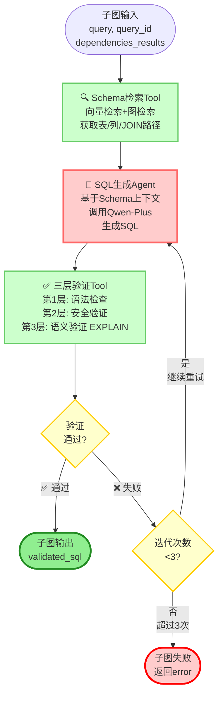

# SQL生成子图详细设计文档

## 📋 文档信息

| 项目名称 | NL2SQL v3 - SQL生成子图 |
|---------|------------------------|
| 版本 | v1.2 |
| 文档类型 | 详细设计文档 |
| 创建日期 | 2025-11-01 |
| 最后更新 | 2025-11-01 |
| 技术栈 | Python 3.12, LangGraph v1.0+, PostgreSQL, pgvector, Neo4j |
| 依赖模块 | db2graph_bak/gen_sql |

---

## 🔄 变更日志（v1.2）

**已更新**（2025-11-01）：

1. **✅ P0 - 历史 SQL 检索对齐**
   - 改为从 `system.sql_embedding.document` 解析 JSON 字段（`question`/`sql`）
   - 保留 `WHERE type = 'sql'` 过滤，避免混入非 SQL 文档

2. **✅ P0 - Neo4j JOIN 规划增强**
   - 支持多 Base（依据 `table_category='fact'` 自动选择），为每个 Base 生成 `JoinPlan`
   - 策略：APOC Dijkstra 优先，失败回退 `shortestPath`
   - 上下文字段统一：`join_paths` → `join_plans`

3. **✅ P1 - 提示词增强**
   - 维度值优化替换：按 `source_index` 绑定，命中 `score≥0.5` 时优先使用命中值
   - JOIN 计划展示采用 Base 样式：`Base #x：**schema.table**` 行文

4. **✅ P1 - 配置项完善**
   - 移除硬编码 LIMIT；新增可配：`topk_tables`、`topk_columns`、`dim_index_topk`、`sql_embedding_top_k`、`join_max_hops`

5. **✅ P1 - 附录表结构对齐**
   - `system.sem_object_vec` 与 `docs/pgvector.sql` 完全一致（含 `table_category`、`lang`、`boost`、`updated_at`、HNSW 索引等）
   - `system.dim_value_index` 增加 `updated_at`，并使用 `public.gin_trgm_ops`

---

## 🔄 变更日志（v1.1）

**修复的问题**（2025-11-01）：

1. **✅ P3 - 类型定义问题**
   - 修复 `dependencies_results` 类型从 `Dict[str, Dict]` 改为 `Dict[str, Any]`，支持列表、数值等类型
   - 修复 `validation_history` 使用 `Annotated[List[Dict], add]` 避免共享可变默认值

2. **✅ P2 - 语法检查过严**
   - 允许 CTE（WITH 查询）和其他只读查询类型
   - 不再仅限于 SELECT，支持 WITH、UNKNOWN 类型

3. **✅ P1 - 安全检查误杀**
   - 使用词边界匹配（`\b`）避免误杀 `created_at` 等正常字段
   - 移除 WHERE/LIMIT 强制要求，由 EXPLAIN 检查性能问题

4. **✅ P1 - 验证逻辑错误**
   - 将 Seq Scan、Nested Loop 从硬错误（errors）改为性能警告（warnings）
   - 只有表不存在、列不存在等才是硬错误，影响 valid 状态

5. **✅ P0 - 缺失核心功能**
   - **增加 `dim_value_index` 维度值检索**（关键功能）
   - 复用 db2graph_bak/gen_sql 的核心能力
   - 支持将"京东便利店"映射到 `store_id='12345'`
   - 使用 pg_trgm 模糊匹配，支持容错

---

## 1. 概述

### 1.1 子图定位

SQL生成子图是NL2SQL v3主流程中的一个**可复用子流程**，负责为**单个子查询**生成经过验证的SQL语句。

**在主流程中的位置**：
```
主流程
  └─ 批次SQL生成节点
       └─ 循环调用 SQL生成子图（N次，每个子查询一次）
```

**职责边界**：
- ✅ 接收：**已拆解的单个子查询**（由诊断Agent完成拆解）
- ✅ 负责：Schema检索、SQL生成、三层验证、重试
- ❌ 不负责：查询拆解、依赖分析、结果聚合（这些由主流程完成）

### 1.2 设计原则

1. **单一职责**：只处理单个子查询的SQL生成
2. **高度复用**：可被主流程多次调用（每个子查询一次）
3. **自包含**：子图内部完成所有SQL生成相关的工作
4. **错误透明**：失败时返回详细错误信息，由主流程决定降级策略

### 1.3 与现有系统的关系

**现有系统（db2graph_bak/gen_sql）使用OpenAI Agent SDK**，包含4个Agent：
- Parser Agent: 解析查询
- Retriever Agent: 检索候选表/列
- Planner Agent: 规划JOIN路径
- Generator Agent: 生成SQL

**新系统（nl2sql_v3）使用LangGraph v1.0**，功能分配：
- **主流程的诊断Agent**：完成查询解析、拆解、候选表/列检索（对应旧系统的Parser + 部分Retriever）
- **SQL生成子图**：完成Schema检索、JOIN规划、SQL生成、验证（对应旧系统的Retriever + Planner + Generator）
- **三层验证Tool（新增）**：语法、安全、语义（EXPLAIN）验证

**复用现有系统的组件**：
- ✅ 数据库连接配置（PostgreSQL + pgvector + Neo4j）
- ✅ Schema检索工具（向量检索 + 图检索）
- ✅ SQL生成提示词模板
- ✅ 表卡片（TableCard）数据结构
- 🔄 改造为LangGraph节点和Tool

---

## 2. 输入输出定义

### 2.1 子图输入

```python
from typing import Dict, List, Optional, Any
from pydantic import BaseModel, Field

class SQLGenerationInput(BaseModel):
    """SQL生成子图的输入"""

    # 核心输入
    query: str = Field(..., description="子查询的自然语言描述（已被诊断Agent拆解）")
    query_id: str = Field(..., description="子查询的唯一标识符，如 'q1', 'q2'")

    # 依赖数据
    dependencies_results: Dict[str, Any] = Field(
        default_factory=dict,
        description="依赖的其他子查询的执行结果，key为query_id，value为结果数据（可能是列表、字典、数值等）"
    )

    # 上下文信息（由主流程传入）
    user_query: str = Field(..., description="用户原始查询（用于语义检索）")
    parse_hints: Optional[Dict[str, Any]] = Field(
        default=None,
        description="诊断Agent提取的解析提示（时间、维度、指标等）"
    )
```

**示例输入**：
```python
{
    "query": "查询2023年Q1销售额",
    "query_id": "q1",
    "dependencies_results": {},  # 无依赖
    "user_query": "对比2023和2024年Q1销售额，计算增长率",
    "parse_hints": {
        "time": {"start": "2023-01-01", "end": "2023-04-01"},
        "metric": {"text": "销售额", "type": "sum"},
        "dimensions": []
    }
}
```

### 2.2 子图输出

```python
from typing import Dict, List, Optional
from pydantic import BaseModel, Field

class SQLGenerationOutput(BaseModel):
    """SQL生成子图的输出"""

    # 成功情况
    validated_sql: Optional[str] = Field(
        default=None,
        description="经过三层验证的SQL语句"
    )

    # 失败情况
    error: Optional[str] = Field(
        default=None,
        description="错误信息（如果生成失败）"
    )
    error_type: Optional[str] = Field(
        default=None,
        description="错误类型：'generation_failed', 'validation_failed', 'timeout'"
    )

    # 元信息
    iteration_count: int = Field(default=0, description="实际重试次数")
    execution_time: float = Field(default=0.0, description="执行耗时（秒）")

    # 调试信息
    schema_context: Optional[Dict] = Field(
        default=None,
        description="使用的Schema上下文（用于调试）"
    )
    validation_history: List[Dict] = Field(
        default_factory=list,
        description="验证历史记录"
    )
```

**成功示例**：
```python
{
    "validated_sql": "SELECT SUM(amount) FROM public.fact_sales WHERE date >= '2023-01-01' AND date < '2023-04-01'",
    "error": null,
    "iteration_count": 1,
    "execution_time": 2.3
}
```

**失败示例**：
```python
{
    "validated_sql": null,
    "error": "验证失败：表 fact_sales_2023 不存在",
    "error_type": "validation_failed",
    "iteration_count": 3,
    "execution_time": 5.1
}
```

---

## 3. 状态定义

### 3.1 子图State

```python
from typing import Annotated, Dict, List, Optional, Any
from operator import add
from langgraph.graph import MessagesState

class SQLGenerationState(MessagesState):
    """SQL生成子图的状态 - 继承自MessagesState支持消息管理"""

    # ========== 输入字段 ==========
    query: str  # 子查询文本
    query_id: str  # 查询ID
    dependencies_results: Dict[str, Any]  # 依赖查询的结果（可能是列表、字典、数值等）
    user_query: str  # 用户原始查询
    parse_hints: Optional[Dict[str, Any]]  # 解析提示

    # ========== Schema检索阶段 ==========
    schema_context: Optional[Dict[str, Any]] = None
    # schema_context结构：
    # {
    #   "tables": [...],           # 相关表列表（向量检索）
    #   "columns": [...],          # 相关列列表（向量检索）
    #   "join_plans": [...],       # JOIN计划（多 Base，图检索）
    #   "table_cards": {...},      # 表卡片字典
    #   "similar_sqls": [...],     # 历史成功SQL案例
    #   "dim_value_matches": [...]  # 维度值匹配结果（新增）
    # }

    # ========== SQL生成阶段 ==========
    generated_sql: Optional[str] = None  # 当前生成的SQL
    iteration_count: int = 0  # 当前迭代次数

    # ========== 验证阶段 ==========
    validation_result: Optional[Dict[str, Any]] = None
    # validation_result结构：
    # {
    #   "valid": bool,
    #   "errors": List[str],
    #   "warnings": List[str],  # 性能警告（新增）
    #   "layer": str,  # "syntax" / "security" / "semantic" / "all_passed"
    #   "explain_plan": Optional[str]  # EXPLAIN结果
    # }
    validation_history: Annotated[List[Dict], add]  # 所有验证历史（使用reducer避免共享可变默认值）

    # ========== 输出字段 ==========
    validated_sql: Optional[str] = None  # 最终验证通过的SQL
    error: Optional[str] = None  # 错误信息
    error_type: Optional[str] = None  # 错误类型
    execution_time: float = 0.0  # 执行耗时
```

### 3.2 状态流转示例

```
初始状态：
{
  "query": "查询2023年Q1销售额",
  "query_id": "q1",
  "iteration_count": 0,
  "validated_sql": null
}

↓ Schema检索Tool

{
  "schema_context": {
    "tables": ["public.fact_sales"],
    "columns": ["amount", "date"],
    "join_plans": [],
    "table_cards": {...}
  }
}

↓ SQL生成Agent

{
  "generated_sql": "SELECT SUM(amount) FROM fact_sales WHERE ...",
  "iteration_count": 1
}

↓ 验证Tool

{
  "validation_result": {
    "valid": false,
    "errors": ["表名缺少schema前缀"],
    "layer": "semantic"
  },
  "validation_history": [...]
}

↓ 重试 SQL生成Agent

{
  "generated_sql": "SELECT SUM(amount) FROM public.fact_sales WHERE ...",
  "iteration_count": 2
}

↓ 验证Tool

{
  "validation_result": {
    "valid": true,
    "errors": [],
    "layer": "all_passed"
  },
  "validated_sql": "SELECT SUM(amount) FROM public.fact_sales WHERE ..."
}
```

---

## 4. 节点设计

### 4.1 Schema检索Tool节点

**职责**：检索与子查询相关的Schema信息，包括表、列、JOIN路径、历史SQL案例

#### 4.1.1 实现框架（与 PG/Neo4j 取数逻辑对齐）

```python
import time
from typing import Dict, List, Optional, Any
from pgvector.psycopg import register_vector
import psycopg
from neo4j import GraphDatabase

class SchemaRetrievalTool:
    """Schema检索工具 - 复用db2graph_bak/gen_sql 的数据源与取数策略"""

    def __init__(self, db_config: dict, neo4j_config: dict, embedding_client, *,
                 topk_tables: int = 10, topk_columns: int = 10,
                 dim_index_topk: int = 5, sql_embedding_top_k: int = 3,
                 join_max_hops: int = 5):
        # PostgreSQL连接（包含pgvector扩展）
        self.conn = psycopg.connect(**db_config)
        register_vector(self.conn)

        # Neo4j连接（JOIN路径检索）
        self.graph_db = GraphDatabase.driver(
            neo4j_config["uri"],
            auth=(neo4j_config["user"], neo4j_config["password"])
        )

        # 嵌入客户端（向量生成）
        self.embedding_client = embedding_client

        # 检索配置
        self.topk_tables = topk_tables
        self.topk_columns = topk_columns
        self.dim_index_topk = dim_index_topk
        self.sql_embedding_top_k = sql_embedding_top_k
        self.join_max_hops = join_max_hops

    def retrieve(self, query: str, parse_hints: Optional[Dict] = None) -> Dict[str, Any]:
        """
        检索Schema上下文

        Args:
            query: 子查询文本
            parse_hints: 解析提示（可选，包含时间、维度、指标等）

        Returns:
            Schema上下文字典
        """
        # 1) 生成查询向量
        query_embedding = self.embedding_client.embed_query(query)

        # 2) 分别检索表与列（与 system.sem_object_vec 结构对齐）
        semantic_tables = self._search_semantic_tables(query_embedding, top_k=self.topk_tables)
        semantic_columns = self._search_semantic_columns(query_embedding, top_k=self.topk_columns)

        # 3) 汇总候选表（列的 parent_id 也应计入）
        table_names = sorted(list({t["object_id"] for t in semantic_tables} |
                                  {c["parent_id"] for c in semantic_columns}))

        # 4) 图检索：JOIN 计划（APOC 优先，最短路回退，多 Base）
        # 基于 table_category 选择 base（事实表），其余为 targets；若无法识别，退化为第一个表为 base
        table_category_map = {t["object_id"]: (t.get("table_category") or "") for t in semantic_tables}
        base_tables = [t for t in table_names if (table_category_map.get(t, "").lower() == "fact")]
        if not base_tables and table_names:
            base_tables = [table_names[0]]
        join_plans = []
        for base in base_tables:
            targets = [t for t in table_names if t != base]
            if targets:
                plan = self.plan_join_paths(base, targets, max_hops=self.join_max_hops)
                if plan and plan.get("edges"):
                    join_plans.append(plan)

        # 5) 获取表卡片
        table_cards = self._fetch_table_cards(table_names)

        # 6) 历史 SQL（向量）检索：system.sql_embedding（从 document 解析 question/sql）
        similar_sqls = self._search_similar_sqls(query_embedding, top_k=self.sql_embedding_top_k)

        # 7) 维度值检索：system.dim_value_index
        dim_value_matches = self._search_dim_values(query, parse_hints)

        return {
            "tables": table_names,
            "columns": semantic_columns,
            "join_plans": join_plans,
            "table_cards": table_cards,
            "similar_sqls": similar_sqls,
            "dim_value_matches": dim_value_matches,
            "metadata": {"retrieval_time": time.time()}
        }

    def _search_semantic_tables(self, embedding: List[float], top_k: int) -> List[Dict]:
        """检索语义相关的表（system.sem_object_vec, object_type='table'）"""
        with self.conn.cursor() as cur:
            cur.execute("""
                SELECT object_id, lang, grain_hint, time_col_hint, table_category,
                       1 - (embedding <=> %s::vector) AS similarity
                FROM system.sem_object_vec
                WHERE object_type = 'table'
                ORDER BY embedding <=> %s::vector
                LIMIT %s
            """, (embedding, embedding, top_k))

            return [
                {
                    "object_id": row[0],
                    "lang": row[1],
                    "grain_hint": row[2],
                    "time_col_hint": row[3],
                    "table_category": row[4],
                    "similarity": row[5]
                }
                for row in cur.fetchall()
            ]

    def _search_semantic_columns(self, embedding: List[float], top_k: int) -> List[Dict]:
        """检索语义相关的列（列携带 parent_id=表，归一化 parent_category）"""
        with self.conn.cursor() as cur:
            cur.execute("""
                SELECT col.object_id, col.parent_id, tbl.table_category AS parent_category,
                       1 - (col.embedding <=> %s::vector) AS similarity
                FROM system.sem_object_vec AS col
                LEFT JOIN system.sem_object_vec AS tbl
                  ON tbl.object_id = col.parent_id AND tbl.object_type = 'table'
                WHERE col.object_type = 'column'
                ORDER BY col.embedding <=> %s::vector
                LIMIT %s
            """, (embedding, embedding, top_k))

            results = []
            for row in cur.fetchall():
                results.append({
                    "object_id": row[0],
                    "parent_id": row[1],
                    "table_category": row[2],  # 调用侧可做 normalize
                    "similarity": row[3]
                })
            return results

    def plan_join_paths(self, base: str, targets: List[str], max_hops: int = 5) -> Dict:
        """为单个 base 表规划 JOIN 计划：APOC 优先、最短路回退，合并所有目标路径"""
        edges_all: List[Dict] = []
        with self.graph_db.session() as session:
            for target in targets:
                path = self._find_shortest_path(session, base, target, max_hops=max_hops)
                if path is None:
                    continue
                for rel in path.relationships:
                    edges_all.append({
                        "src_table": rel.start_node.get("id") or rel.start_node.get("name"),
                        "dst_table": rel.end_node.get("id") or rel.end_node.get("name"),
                        "constraint_name": rel.get("constraint_name"),
                        "join_type": rel.get("join_type", "INNER JOIN"),
                        "cardinality": rel.get("cardinality"),
                        "on": rel.get("on_clause"),
                        "cost": rel.get("cost", 1.0),
                    })
        return {"base": base, "edges": edges_all}

    def _find_shortest_path(self, session, base: str, target: str, max_hops: int = 5):
        """优先使用 APOC Dijkstra（关系 JOIN_ON, cost 权重），回退 shortestPath"""
        # 首选 APOC（若安装）
        try:
            result = session.run(
                """
                MATCH (src:Table {id: $base}), (dst:Table {id: $target})
                CALL apoc.algo.dijkstraWithDefaultWeight(src, dst, 'JOIN_ON', 'cost', 1.0)
                YIELD path, weight
                RETURN path
                ORDER BY weight ASC
                LIMIT 1
                """,
                base=base,
                target=target,
            )
            record = result.single()
            if record and record.get("path"):
                return record.get("path")
        except Exception:
            pass

        # 回退最短路
        result = session.run(
            f"""
            MATCH path = shortestPath((src:Table {{id: $base}})-[:JOIN_ON*..{max_hops}]-(dst:Table {{id: $target}}))
            RETURN path
            LIMIT 1
            """,
            base=base,
            target=target,
        )
        record = result.single()
        return record.get("path") if record else None

    def _fetch_table_cards(self, table_names: List[str]) -> Dict[str, Dict]:
        """获取表卡片（表的详细描述）"""
        with self.conn.cursor() as cur:
            cur.execute("""
                SELECT
                    object_id,
                    text_raw,
                    grain_hint,
                    time_col_hint,
                    attrs
                FROM system.sem_object_vec
                WHERE object_type = 'table'
                  AND object_id = ANY(%s)
            """, (table_names,))

            cards = {}
            for row in cur.fetchall():
                cards[row[0]] = {
                    "text_raw": row[1],
                    "grain_hint": row[2],
                    "time_col_hint": row[3],
                    "attrs": row[4]
                }

            return cards

    def _search_similar_sqls(self, embedding: List[float], top_k: int) -> List[Dict]:
        """从 system.sql_embedding 检索历史相似 SQL：解析 document JSON 获取 question/sql"""
        import json
        with self.conn.cursor() as cur:
            cur.execute(
                """
                SELECT document,
                       1 - (embedding <=> %s::vector) AS similarity
                FROM system.sql_embedding
                WHERE type = 'sql'
                ORDER BY embedding <=> %s::vector
                LIMIT %s
                """,
                (embedding, embedding, top_k),
            )

            hits = []
            for row in cur.fetchall():
                doc_str = row[0]
                sim = float(row[1])
                question = ""
                sql_text = ""
                try:
                    doc = json.loads(doc_str) if isinstance(doc_str, str) else (doc_str or {})
                    question = doc.get("question", "")
                    sql_text = doc.get("sql", "")
                except Exception:
                    # 降级：无法解析时将原文作为 SQL 展示
                    sql_text = doc_str
                hits.append({
                    "question": question,
                    "sql": sql_text,
                    "similarity": sim,
                })
            return hits

    # 注：表名集合已在 retrieve 中汇总，不再单独提供 _extract_tables

    def _search_dim_values(self, query: str, parse_hints: Optional[Dict]) -> List[Dict]:
        """
        从 system.dim_value_index 检索维度值匹配

        这是关键功能，用于将用户查询中的维度值（如"京东便利店"、"广东省"）
        映射到具体的主键ID，以便在WHERE条件中使用。

        Args:
            query: 子查询文本
            parse_hints: 解析提示，包含dimensions字段

        Returns:
            维度值匹配列表
        """
        matches = []

        # 从 parse_hints 提取维度值候选
        if parse_hints and parse_hints.get("dimensions"):
            for source_index, dim in enumerate(parse_hints["dimensions"]):
                # 只处理 role="value" 的维度（维度值，而非列名）
                if dim.get("role") == "value":
                    value_text = dim["text"]

                    # 使用 pg_trgm 模糊匹配（支持容错）
                    with self.conn.cursor() as cur:
                        cur.execute("""
                            SELECT
                                dim_table,
                                dim_col,
                                key_col,
                                key_value,
                                value_text,
                                word_similarity(value_norm, norm_zh(%s)) AS score
                            FROM system.dim_value_index
                            WHERE value_norm %% norm_zh(%s)  -- word_similarity operator
                            ORDER BY score DESC
                            LIMIT %s
                        """, (value_text, value_text, self.dim_index_topk))

                        for row in cur.fetchall():
                            matches.append({
                                "query_value": value_text,      # 用户输入的原始文本
                                "dim_table": row[0],            # 维表名，如 dim_store
                                "dim_col": row[1],              # 维度列名，如 store_name
                                "key_col": row[2],              # 主键列名，如 store_id
                                "key_value": row[3],            # 主键值，如 '12345'
                                "matched_text": row[4],         # 匹配到的文本，如 '京东便利店(XX路店)'
                                "score": float(row[5]),         # 相似度分数
                                "source_index": source_index    # 绑定到对应维度
                            })

        return matches


def schema_retrieval_node(state: SQLGenerationState) -> SQLGenerationState:
    """Schema检索节点"""
    tool = SchemaRetrievalTool(db_config, neo4j_config, embedding_client)

    schema_context = tool.retrieve(
        query=state["query"],
        parse_hints=state.get("parse_hints")
    )

    return {
        **state,
        "schema_context": schema_context
    }
```

#### 4.1.2 检索策略

1. **向量检索（pgvector / system.sem_object_vec）**
   - 检索拆分：表与列分别检索。
   - 表检索 SQL：按 `<=>` 余弦距离排序取 Top-K（`topk_tables`）。
   - 列检索 SQL：LEFT JOIN 表对象以带回 `parent_category`，按 `<=>` 排序取 Top-K（`topk_columns`）。
   - 分类依据：以 `table_category` 字段归一化分类（事实/维度/桥接），不依赖 `text_raw` 文本描述。
   - 阈值过滤：使用 `similarity_threshold` 进行二次过滤。

2. **图检索（Neo4j / JOIN_ON）**
   - 关系类型：`JOIN_ON`；默认跳数：`1..5`（可配置 `join_max_hops`）。
   - 策略：优先使用 APOC `apoc.algo.dijkstraWithDefaultWeight` 进行加权最短路；如不可用，回退 `shortestPath`。
   - 结果：展开为边列表，包含 `src_table`、`dst_table`、`constraint_name`、`join_type`、`cardinality`、`on`、`cost` 等。

3. **表卡片获取**
   - 数据源：`system.sem_object_vec` 的 `object_type='table'` 记录。
   - 字段：`text_raw`、`grain_hint`、`time_col_hint`、`attrs`。

4. **历史 SQL 检索（向量库）**
   - 数据源：`system.sql_embedding`（以表结构定义为准，见附录）。
   - 方法：以问题向量查询 `embedding`，从 `document` 字段解析 JSON 获取 `question` 与 `sql`。
   - 降级处理：若 `document` 无法解析为 JSON，则将原文作为 SQL 展示。

5. **维度值检索（关键功能 / system.dim_value_index）**
   - 匹配算法：`pg_trgm` + 自定义 `norm_zh()` 的 `%%` 与 `word_similarity()`。
   - Top-K：每个维度值返回 `dim_index_topk` 条最佳匹配（默认 3-5，可配）。
   - 返回说明：`dim_table` 不含 schema 前缀；生成 SQL 时需按默认 `schema`（如 `public`）或表卡片补齐。
   - 使用建议：当分数 ≥ 阈值（如 `0.5`/`0.8`）时优先替换为主键等值过滤。

---

### 4.2 SQL生成Agent节点

**职责**：基于Schema上下文和用户查询，调用LLM生成SQL语句

#### 4.2.1 实现框架

```python
from langchain_community.chat_models import ChatTongyi
from langchain_core.messages import SystemMessage, HumanMessage

class SQLGenerationAgent:
    """SQL生成Agent - 使用Qwen-Plus"""

    def __init__(self, model: str = "qwen-plus", api_key: str = None):
        self.llm = ChatTongyi(
            model=model,
            dashscope_api_key=api_key,
            temperature=0,  # 确定性输出
            max_tokens=2000
        )

    def generate(
        self,
        query: str,
        schema_context: Dict[str, Any],
        parse_hints: Optional[Dict] = None,
        dependencies_results: Optional[Dict] = None,
        validation_errors: Optional[List[str]] = None
    ) -> str:
        """
        生成SQL

        Args:
            query: 子查询文本
            schema_context: Schema上下文（由检索Tool提供）
            parse_hints: 解析提示（时间、维度、指标）
            dependencies_results: 依赖查询的结果
            validation_errors: 上一次的验证错误（重试时使用）

        Returns:
            生成的SQL字符串
        """
        prompt = self._build_prompt(
            query=query,
            schema_context=schema_context,
            parse_hints=parse_hints,
            dependencies_results=dependencies_results,
            validation_errors=validation_errors
        )

        messages = [
            SystemMessage(content="You are an expert PostgreSQL SQL writer. Return valid SQL only."),
            HumanMessage(content=prompt)
        ]

        response = self.llm.invoke(messages)

        # 清理SQL（去除markdown标记）
        sql = response.content.strip()
        sql = sql.replace("```sql", "").replace("```", "").strip()

        return sql

    def _build_prompt(
        self,
        query: str,
        schema_context: Dict[str, Any],
        parse_hints: Optional[Dict],
        dependencies_results: Optional[Dict],
        validation_errors: Optional[List[str]]
    ) -> str:
        """构建SQL生成提示词"""

        # 提取解析提示
        time_info = ""
        dimension_filters = ""
        metric_info = ""

        if parse_hints:
            time_window = parse_hints.get("time", {})
            if time_window:
                start = time_window.get("start", "")
                end = time_window.get("end", "")
                time_info = f"时间窗口：{start} ~ {end}"

            dimensions = parse_hints.get("dimensions", [])
            if dimensions:
                filters = []
                # 维度值优化替换：对 role=value 的维度按 source_index 选最佳匹配
                dim_matches = schema_context.get("dim_value_matches", [])
                optimize_min_score = 0.5
                for idx, dim in enumerate(dimensions):
                    if dim.get("role") == "value":
                        best = None
                        best_score = -1.0
                        for m in dim_matches:
                            if m.get("source_index") == idx and m.get("score", 0) > best_score:
                                best = m
                                best_score = m.get("score", 0)
                        if best and best_score >= optimize_min_score and best.get("matched_text"):
                            filters.append(f"value={best.get('matched_text')}")
                        else:
                            filters.append(f"value={dim.get('text')}")
                    elif dim.get("role") == "column":
                        filters.append(f"column={dim.get('text')}")
                dimension_filters = f"维度过滤：{', '.join(filters)}"

            metric = parse_hints.get("metric", {})
            if metric:
                metric_info = f"指标：{metric.get('text', '')}"

        # 格式化表结构卡片
        table_cards_text = self._format_table_cards(schema_context.get("table_cards", {}))

        # 格式化JOIN计划（多 Base）
        join_plans_text = self._format_join_plans(schema_context.get("join_plans", []))

        # 格式化时间列
        time_columns_text = self._format_time_columns(schema_context.get("table_cards", {}))

        # 格式化历史SQL案例
        similar_sqls_text = self._format_similar_sqls(schema_context.get("similar_sqls", []))

        # 格式化维度值匹配（新增）
        dim_values_text = self._format_dim_values(schema_context.get("dim_value_matches", []))

        # 格式化依赖结果
        dependencies_text = ""
        if dependencies_results:
            deps = []
            for query_id, result in dependencies_results.items():
                deps.append(f"- {query_id}: {result}")
            dependencies_text = f"\n\n依赖查询结果：\n" + "\n".join(deps)

        # 格式化验证错误（重试时）
        errors_text = ""
        if validation_errors:
            errors_text = f"\n\n⚠️ 上一次生成的SQL验证失败，请修正以下错误：\n" + "\n".join(f"- {err}" for err in validation_errors)

        # 组装完整提示词
        prompt = f"""你是 PostgreSQL SQL 生成专家。根据以下上下文生成 SQL。

要求：
1. 仅输出 SQL，不附加说明。
2. 所有表必须包含 schema 前缀（例如 public.table）。
3. 时间过滤使用指定列，并遵循 >= start AND < end 的半开区间。
4. JOIN 条件必须严格按照 ON 模板，用实际别名替换 SRC/DST。
5. 以下提供的表结构、JOIN 计划和时间列为参考，你可以选择性使用它们，但不得使用未列出的字段。
6. **重要**：如果提供了维度值匹配，优先使用主键过滤（如 store_id = '12345'）而非文本匹配。

---

方言：postgresql
问题：{query}
{time_info}
{dimension_filters}
{metric_info}{dependencies_text}{errors_text}

---

表结构：
{table_cards_text}

---

JOIN 计划：
{join_plans_text}

---

时间列：
{time_columns_text}

---

维度值匹配（用于 WHERE 条件）：
{dim_values_text}

---

历史成功SQL案例（参考）：
{similar_sqls_text}
"""

        return prompt.strip()

    def _format_table_cards(self, table_cards: Dict[str, Dict]) -> str:
        """格式化表卡片"""
        lines = []
        for table_id, card in table_cards.items():
            text_raw = card.get("text_raw", "").replace("\n", " ").strip()
            lines.append(f"- **{table_id}**  {text_raw}")
        return "\n".join(lines) if lines else "（无）"

    def _format_join_plans(self, join_plans: List[Dict]) -> str:
        """格式化 JOIN 计划（支持多 Base）"""
        if not join_plans:
            return "（无JOIN，单表查询）"

        segments = []
        for idx, plan in enumerate(join_plans[:3], 1):  # 最多显示3个计划
            base_table = plan.get("base", "")
            lines = [f"Base #{idx}：**{base_table}**"]
            for edge in plan.get("edges", []):
                on_clause = edge.get("on", "<missing on>")
                join_type = edge.get("join_type", "INNER JOIN")
                card = edge.get("cardinality", "")
                card_part = f" ({card})" if card else ""
                lines.append(
                    f"- {edge['src_table']} --{join_type}{card_part}--> {edge['dst_table']} ON {on_clause}"
                )
            segments.append("\n".join(lines))

        return "\n\n".join(segments)

    def _format_time_columns(self, table_cards: Dict[str, Dict]) -> str:
        """格式化时间列"""
        lines = []
        for table_id, card in table_cards.items():
            time_col = card.get("time_col_hint")
            if time_col:
                lines.append(f"- {table_id}.{time_col}")
        return "\n".join(lines) if lines else "（无明确时间列）"

    def _format_similar_sqls(self, similar_sqls: List[Dict]) -> str:
        """格式化历史 SQL 相似案例（从 document 解析 question/sql）"""
        if not similar_sqls:
            return "（无相似案例）"

        lines = []
        for idx, hit in enumerate(similar_sqls[:2], 1):  # 最多显示 2 个
            sim = hit.get("similarity", 0.0)
            question = hit.get("question", "")
            sql_text = hit.get("sql", "")

            header = f"{idx}. 相似度：{sim:.2f}"
            lines.append(header)
            if question:
                lines.append(f"   查询：{question}")
            if sql_text:
                lines.append(f"   SQL：{sql_text}")

        return "\n".join(lines)

    def _format_dim_values(self, matches: List[Dict]) -> str:
        """
        格式化维度值匹配结果

        示例输出：
        - '京东便利店' → dim_store.store_id='12345' (匹配: 京东便利店(XX路店), 相似度: 0.95)
        - '广东省' → dim_region.province_id='44' (匹配: 广东省, 相似度: 1.00)
        """
        if not matches:
            return "（无）"

        lines = []
        for m in matches:
            # 构建建议的WHERE条件
            suggested_condition = f"{m['dim_table']}.{m['key_col']}='{m['key_value']}'"

            # 格式化输出
            lines.append(
                f"- '{m['query_value']}' → {suggested_condition} "
                f"(匹配: {m['matched_text']}, 相似度: {m['score']:.2f})"
            )

        lines.append("")
        lines.append("**使用建议**：")
        lines.append("- 优先使用主键过滤（如 store_id = '12345'）而非文本匹配")
        lines.append("- 如果相似度 >= 0.8，直接使用主键条件")
        lines.append("- 如果相似度 < 0.8，可考虑使用 LIKE 模糊匹配或让用户确认")

        return "\n".join(lines)


def sql_generation_node(state: SQLGenerationState) -> SQLGenerationState:
    """SQL生成节点"""
    agent = SQLGenerationAgent(model="qwen-plus", api_key=os.getenv("DASHSCOPE_API_KEY"))

    # 获取上一次的验证错误（如果有）
    validation_errors = None
    if state.get("validation_result"):
        if not state["validation_result"].get("valid"):
            validation_errors = state["validation_result"].get("errors", [])

    generated_sql = agent.generate(
        query=state["query"],
        schema_context=state["schema_context"],
        parse_hints=state.get("parse_hints"),
        dependencies_results=state.get("dependencies_results"),
        validation_errors=validation_errors
    )

    return {
        **state,
        "generated_sql": generated_sql,
        "iteration_count": state.get("iteration_count", 0) + 1
    }
```

#### 4.2.2 Prompt设计要点

**参考现有系统的Generator Agent**，提示词包含：

1. **明确要求**
   - 只输出SQL，不要解释
   - 表名必须带schema前缀
   - 时间过滤使用半开区间
   - JOIN条件严格按照模板

2. **上下文信息**
   - 用户问题
   - 时间窗口
   - 维度过滤
   - 指标描述

3. **表结构卡片**
   - 表的完整描述（text_raw）
   - 时间粒度提示（grain_hint）
   - 示例数据（attrs.sample）

4. **JOIN计划**
   - 多个可选方案
   - ON条件模板
   - 基数提示（N:1, 1:N）

5. **时间列提示**
   - 每个表的推荐时间列

6. **历史案例（可选）**
   - 相似查询的成功SQL

7. **重试时的错误反馈**
   - 上一次的验证错误列表

8. **维度值优化**（与 dim_value_index 对齐）
   - 若维度值命中分数 ≥ 阈值（如 0.5/0.8），提示词中引导优先使用主键等值过滤。
   - 未达阈值时仅展示命中预览，避免误用等值过滤。

9. **多 Base JOIN 计划展示**
   - 多个 Base（候选事实表）产生的 `JoinPlan` 在提示词中全部展示，由 LLM 按语义自行选择/组合。

---

### 4.3 三层验证Tool节点

**职责**：对生成的SQL进行语法、安全、语义三层验证

#### 4.3.1 实现框架

```python
import re
from typing import Dict, List, Optional, Any
import sqlparse
import psycopg

class SQLValidationTool:
    """三层SQL验证工具"""

    def __init__(self, db_config: dict):
        self.db_config = db_config

    def validate(self, sql: str) -> Dict[str, Any]:
        """
        三层验证SQL

        Returns:
            {
                "valid": bool,
                "errors": List[str],
                "warnings": List[str],  # 性能警告
                "layer": str,  # "syntax" / "security" / "semantic" / "all_passed"
                "explain_plan": Optional[str]
            }
        """
        errors = []
        all_warnings = []  # 累积所有警告

        # 第1层：语法检查
        syntax_result = self._check_syntax(sql)
        if syntax_result["errors"]:
            return {
                "valid": False,
                "errors": syntax_result["errors"],
                "warnings": syntax_result["warnings"],  # 传递语法警告
                "layer": "syntax",
                "explain_plan": None
            }
        # 累积语法警告
        all_warnings.extend(syntax_result["warnings"])

        # 第2层：安全验证
        security_errors = self._check_security(sql)
        if security_errors:
            return {
                "valid": False,
                "errors": security_errors,
                "warnings": all_warnings,  # 传递已累积的警告
                "layer": "security",
                "explain_plan": None
            }

        # 第3层：语义验证（EXPLAIN）
        semantic_result = self._check_semantics(sql)
        if not semantic_result["valid"]:
            # 合并所有警告
            combined_warnings = all_warnings + semantic_result.get("warnings", [])
            return {
                "valid": False,
                "errors": semantic_result["errors"],
                "warnings": combined_warnings,  # 传递所有累积的警告
                "layer": "semantic",
                "explain_plan": semantic_result.get("explain_plan")
            }

        # 全部通过 - 合并所有警告
        combined_warnings = all_warnings + semantic_result.get("warnings", [])
        return {
            "valid": True,
            "errors": [],
            "warnings": combined_warnings,  # 传递所有累积的警告（语法+性能）
            "layer": "all_passed",
            "explain_plan": semantic_result.get("explain_plan")
        }

    def _check_syntax(self, sql: str) -> Dict[str, Any]:
        """
        第1层：语法检查（使用sqlparse）

        Returns:
            {
                "errors": List[str],    # 硬错误
                "warnings": List[str]   # 警告信息
            }
        """
        errors = []
        warnings = []

        try:
            parsed = sqlparse.parse(sql)
            if not parsed:
                errors.append("SQL解析失败：无法识别的SQL语句")
            elif len(parsed) > 1:
                errors.append("不允许执行多条SQL语句")
            else:
                stmt = parsed[0]
                # 允许SELECT、WITH（CTE）、UNKNOWN（WITH...SELECT的解析结果）
                allowed_types = {'SELECT', 'WITH', 'UNKNOWN'}
                stmt_type = stmt.get_type()

                if stmt_type not in allowed_types:
                    # 额外检查：确保没有修改操作
                    sql_upper = sql.upper()
                    write_keywords = ['INSERT', 'UPDATE', 'DELETE', 'DROP', 'CREATE', 'ALTER', 'TRUNCATE']
                    found_write = [kw for kw in write_keywords if f' {kw} ' in f' {sql_upper} ']

                    if found_write:
                        errors.append(f"只允许只读查询，检测到修改操作：{', '.join(found_write)}")
                    else:
                        # 类型不在允许列表，但没检测到修改操作，给出警告而非硬错误
                        warnings.append(f"SQL类型为 {stmt_type}，请确保是只读查询")
        except Exception as e:
            errors.append(f"语法解析错误：{str(e)}")

        return {"errors": errors, "warnings": warnings}

    def _check_security(self, sql: str) -> List[str]:
        """第2层：安全检查（防止危险操作）"""
        import re

        errors = []
        sql_upper = sql.upper()

        # 禁止的关键字 - 使用词边界匹配避免误杀（如 created_at 中的 CREATE）
        dangerous_patterns = [
            r'\bDROP\b', r'\bDELETE\b', r'\bTRUNCATE\b',
            r'\bALTER\b', r'\bCREATE\b', r'\bINSERT\b',
            r'\bUPDATE\b', r'\bGRANT\b', r'\bREVOKE\b',
            r'\bEXEC\b', r'\bEXECUTE\b'
        ]

        for pattern in dangerous_patterns:
            if re.search(pattern, sql_upper):
                keyword = pattern.strip(r'\b')
                errors.append(f"禁止使用关键字：{keyword}")

        # 检查注释注入
        if "--" in sql or "/*" in sql:
            errors.append("SQL中不允许包含注释（防止注入）")

        # 检查分号（防止多语句）
        if sql.count(";") > 1:
            errors.append("不允许执行多条SQL语句")

        # 注意：移除了 WHERE/LIMIT 强制要求
        # 原因：会误杀合法的维度枚举查询、TOP-N查询等
        # 全表扫描问题由后续的 EXPLAIN 检查处理

        return errors

    def _check_semantics(self, sql: str) -> Dict[str, Any]:
        """第3层：语义验证（使用EXPLAIN检查）"""
        errors = []      # 硬错误：表不存在、列不存在等
        warnings = []    # 性能警告：Seq Scan、Nested Loop等
        explain_plan = None

        try:
            with psycopg.connect(**self.db_config) as conn:
                with conn.cursor() as cur:
                    # 执行EXPLAIN（不实际执行查询）
                    explain_sql = f"EXPLAIN {sql}"
                    cur.execute(explain_sql)

                    plan_lines = [row[0] for row in cur.fetchall()]
                    explain_plan = "\n".join(plan_lines)

                    # 分析查询计划，检测潜在问题
                    plan_text = " ".join(plan_lines).upper()

                    # 性能警告（不影响valid状态）
                    if "SEQ SCAN" in plan_text:
                        warnings.append("检测到顺序扫描（Seq Scan），可能影响性能")

                    if "NESTED LOOP" in plan_text and "JOIN" not in sql.upper():
                        warnings.append("可能存在笛卡尔积，请检查JOIN条件")

        except psycopg.errors.UndefinedTable as e:
            errors.append(f"表不存在：{str(e)}")
        except psycopg.errors.UndefinedColumn as e:
            errors.append(f"列不存在：{str(e)}")
        except psycopg.errors.SyntaxError as e:
            errors.append(f"SQL语法错误：{str(e)}")
        except Exception as e:
            errors.append(f"语义验证失败：{str(e)}")

        return {
            "valid": len(errors) == 0,  # 只有硬错误才影响valid
            "errors": errors,
            "warnings": warnings,  # 新增：性能警告
            "explain_plan": explain_plan
        }


def validation_node(state: SQLGenerationState) -> SQLGenerationState:
    """验证节点"""
    tool = SQLValidationTool(db_config)

    validation_result = tool.validate(state["generated_sql"])

    # 记录验证历史
    validation_history = state.get("validation_history", [])
    validation_history.append({
        "iteration": state["iteration_count"],
        "sql": state["generated_sql"],
        "result": validation_result
    })

    # 如果验证通过，更新validated_sql
    validated_sql = None
    if validation_result["valid"]:
        validated_sql = state["generated_sql"]

    return {
        **state,
        "validation_result": validation_result,
        "validation_history": validation_history,
        "validated_sql": validated_sql
    }
```

#### 4.3.2 验证层次详解

**第1层：语法检查**
- 工具：`sqlparse` 库
- 检查内容：
  - SQL是否可解析
  - 是否为只读查询（允许 SELECT、WITH、CTE）
  - 是否包含多条语句
  - 是否包含修改操作（INSERT、UPDATE、DELETE等）

**第2层：安全检查**
- 检查内容：
  - 禁止危险关键字（使用词边界匹配，避免误杀 created_at 等字段）
  - 禁止注释（防注入）
  - 禁止多语句执行
  - **注意**：不再强制要求 WHERE/LIMIT，由第3层 EXPLAIN 检查性能

**第3层：语义检查（EXPLAIN）**
- 方法：执行 `EXPLAIN SQL`（不实际查询数据）
- 检查内容（区分硬错误和警告）：
  - **硬错误**（影响 valid 状态）：
    - 表不存在
    - 列不存在
    - SQL 语法错误
  - **性能警告**（不影响 valid 状态）：
    - 顺序扫描（Seq Scan）
    - 笛卡尔积风险（Nested Loop 无 JOIN）
- 返回：查询计划、错误列表、警告列表

---

## 5. 子图流程定义

### 5.1 LangGraph子图实现

```python
from langgraph.graph import StateGraph, START, END

def create_sql_generation_subgraph():
    """创建SQL生成子图 - LangGraph v1.0+"""

    subgraph = StateGraph(SQLGenerationState)

    # 添加节点
    subgraph.add_node("schema_retrieval", schema_retrieval_node)
    subgraph.add_node("sql_generation", sql_generation_node)
    subgraph.add_node("validation", validation_node)

    # 入口
    subgraph.add_edge(START, "schema_retrieval")

    # 固定边
    subgraph.add_edge("schema_retrieval", "sql_generation")
    subgraph.add_edge("sql_generation", "validation")

    # 条件边：根据验证结果决定重试或结束
    subgraph.add_conditional_edges(
        "validation",
        should_retry,
        {
            "retry": "sql_generation",  # 验证失败且未超过3次 -> 重试
            "success": END,             # 验证通过 -> 结束
            "fail": END                 # 验证失败且已重试3次 -> 结束
        }
    )

    return subgraph.compile()


def should_retry(state: SQLGenerationState) -> str:
    """判断是否应该重试"""

    # 验证通过 -> 成功结束
    if state.get("validated_sql"):
        return "success"

    # 未超过3次 -> 重试
    if state["iteration_count"] < 3:
        return "retry"

    # 已重试3次 -> 失败结束
    return "fail"
```

### 5.2 流程图（Mermaid）



---

## 6. 重试机制

### 6.1 重试策略

- **最大重试次数**：3次（包含首次生成）
- **重试触发条件**：验证失败且 `iteration_count < 3`
- **重试时的改进**：
  - 将上一次的**验证错误信息**添加到提示词
  - LLM根据错误信息调整SQL生成策略
  - State中的`validation_history`保留所有尝试记录

### 6.2 重试流程示例

```
第1次尝试：
  SQL生成 -> "SELECT amount FROM fact_sales WHERE ..."
  验证失败 -> "表名缺少schema前缀"

第2次尝试（携带错误信息）：
  SQL生成 -> "SELECT amount FROM public.fact_sales WHERE ..."
  验证失败 -> "列不存在：amount（应为 sales_amount）"

第3次尝试（携带错误信息）：
  SQL生成 -> "SELECT sales_amount FROM public.fact_sales WHERE ..."
  验证通过 -> 返回validated_sql
```

### 6.3 State中的错误传递

LangGraph会自动将state传递给下一个节点，因此：
- `validation_result` 中的 `errors` 会在重试时传递给 `sql_generation_node`
- SQL生成Agent会从state中读取 `validation_result["errors"]` 并添加到提示词

---

## 7. 数据流转示例

### 7.1 完整执行示例

**输入**：
```python
{
    "query": "查询2023年Q1各店铺的销售额，按金额降序",
    "query_id": "q1",
    "dependencies_results": {},
    "user_query": "对比2023和2024年Q1各店铺销售额",
    "parse_hints": {
        "time": {"start": "2023-01-01", "end": "2023-04-01"},
        "metric": {"text": "销售额", "type": "sum"},
        "dimensions": [
            {"text": "店铺", "role": "column"}
        ]
    }
}
```

**步骤1：Schema检索Tool**

输出到state：
```python
{
    "schema_context": {
        "tables": ["public.fact_store_sales_day", "public.dim_store"],
        "columns": [
            {"object_id": "public.fact_store_sales_day.amount", "similarity": 0.92},
            {"object_id": "public.dim_store.store_name", "similarity": 0.87}
        ],
        "join_plans": [
            {
                "edges": [
                    {
                        "src_table": "public.fact_store_sales_day",
                        "dst_table": "public.dim_store",
                        "on": "SRC.store_id = DST.store_id",
                        "join_type": "INNER JOIN"
                    }
                ]
            }
        ],
        "table_cards": {
            "public.fact_store_sales_day": {
                "text_raw": "店铺销售日流水事实表，按天汇总数据...",
                "grain_hint": "daily",
                "time_col_hint": "date_day"
            },
            "public.dim_store": {
                "text_raw": "店铺维表，包含店铺ID、名称等信息...",
                "grain_hint": null,
                "time_col_hint": null
            }
        },
        "similar_sqls": [
            {
                "query": "查询各店铺2022年销售额",
                "sql": "SELECT store_name, SUM(amount) FROM ...",
                "similarity": 0.85
            }
        ]
    }
}
```

**步骤2：SQL生成Agent**

生成的SQL：
```sql
SELECT
    ds.store_name AS store,
    SUM(fs.amount) AS total_sales
FROM
    public.fact_store_sales_day fs
INNER JOIN
    public.dim_store ds ON fs.store_id = ds.store_id
WHERE
    fs.date_day >= '2023-01-01'
    AND fs.date_day < '2023-04-01'
GROUP BY
    ds.store_name
ORDER BY
    total_sales DESC;
```

输出到state：
```python
{
    "generated_sql": "SELECT ds.store_name AS store, ...",
    "iteration_count": 1
}
```

**步骤3：三层验证Tool**

验证结果：
```python
{
    "validation_result": {
        "valid": True,
        "errors": [],
        "layer": "all_passed",
        "explain_plan": "Aggregate ... -> Hash Join ... -> Seq Scan ..."
    },
    "validated_sql": "SELECT ds.store_name AS store, ...",
    "validation_history": [
        {
            "iteration": 1,
            "sql": "SELECT ds.store_name AS store, ...",
            "result": {"valid": True, ...}
        }
    ]
}
```

**最终输出**：
```python
{
    "validated_sql": "SELECT ds.store_name AS store, SUM(fs.amount) AS total_sales ...",
    "error": null,
    "iteration_count": 1,
    "execution_time": 2.3,
    "schema_context": {...},
    "validation_history": [...]
}
```

---

## 8. 与现有系统的对比

### 8.1 功能对比表

| 功能模块 | 现有系统（db2graph_bak/gen_sql） | 新系统（nl2sql_v3 SQL生成子图） |
|---------|--------------------------------|--------------------------------|
| **架构** | OpenAI Agent SDK | LangGraph v1.0+ |
| **查询解析** | Parser Agent（独立） | 主流程的诊断Agent完成 |
| **候选表检索** | Retriever Agent | 主流程的诊断Agent完成 |
| **Schema检索** | Retriever Agent | 子图内的Schema检索Tool |
| **JOIN规划** | Planner Agent | 子图内的Schema检索Tool（图检索） |
| **SQL生成** | Generator Agent | 子图内的SQL生成Agent |
| **SQL验证** | ❌ 无 | ✅ 三层验证Tool（新增） |
| **重试机制** | ❌ 无 | ✅ 最多3次重试 |
| **数据源** | pgvector + Neo4j | 复用相同数据源 |
| **LLM** | OpenAI GPT | Qwen-Plus |

### 8.2 优势分析

**新系统的优势**：

1. **职责分离清晰**
   - 主流程：查询拆解、路由决策、结果聚合
   - 子图：专注于单个子查询的SQL生成

2. **可复用性强**
   - 子图可被主流程多次调用（每个子查询一次）
   - 子图内部逻辑独立，易于测试

3. **验证机制完善**
   - 三层验证确保SQL质量
   - EXPLAIN检查避免性能问题

4. **自动重试**
   - 验证失败时自动重试
   - 错误信息反馈给LLM改进

5. **状态管理**
   - LangGraph自动管理state
   - 验证历史完整记录

6. **易于扩展**
   - 可轻松添加新的验证层
   - 可接入其他LLM模型

### 8.3 复用现有系统的部分

**直接复用**：
- ✅ `system.sem_object_vec` 表（Schema向量存储）
- ✅ Neo4j JOIN关系图
- ✅ TableCard数据结构
- ✅ 表卡片的text_raw格式
- ✅ SQL生成提示词模板

**需要改造**：
- 🔄 将Agent SDK的Agent改为LangGraph节点
- 🔄 将工具函数封装为LangGraph Tool
- 🔄 将Pydantic模型适配到LangGraph State

---

### 8.4 差异说明（与本文件早期版本相比）

- 历史 SQL 检索：由原先示例性的 `system.sql_history` 改为与现项目一致的 `system.sql_embedding`（向量召回，返回 `document/cmetadata`）。
- Neo4j 路径检索：关系类型明确为 `JOIN_ON`，默认最大跳数由 3 提升为 5；策略为 APOC Dijkstra 优先、`shortestPath` 回退。
- 语义检索：表/列检索分开执行，并基于 `table_category` 进行分类与归一化，不再依赖 `text_raw` 文本描述进行分类。

## 9. 实现建议

### 9.1 实施步骤（Phase 1: 第1-2周）

**Week 1: 基础框架**
1. ✅ 定义SQLGenerationState
2. ✅ 实现Schema检索Tool
   - 复用db2graph_bak/gen_sql的数据库连接
   - 实现向量检索（pgvector）
   - 实现图检索（Neo4j）
   - 实现表卡片获取
3. ✅ 搭建子图框架
   - 创建子图结构
   - 添加3个节点
   - 定义条件边

**Week 2: 核心功能**
4. ✅ 实现SQL生成Agent
   - 配置Qwen-Plus
   - 构建提示词
   - 测试SQL生成质量
5. ✅ 实现三层验证Tool
   - 语法检查（sqlparse）
   - 安全检查
   - 语义检查（EXPLAIN）
6. ✅ 实现重试机制
   - 错误信息传递
   - 条件判断逻辑
7. ✅ 单元测试
   - 测试每个节点
   - 测试完整流程
   - 测试重试逻辑

### 9.2 测试用例

**测试用例1：简单单表查询**
```python
input_data = {
    "query": "查询2024年总销售额",
    "query_id": "q1",
    "dependencies_results": {},
    "user_query": "查询2024年总销售额",
    "parse_hints": {
        "time": {"start": "2024-01-01", "end": "2025-01-01"},
        "metric": {"text": "销售额", "type": "sum"}
    }
}

expected_sql = "SELECT SUM(amount) FROM public.fact_sales WHERE date >= '2024-01-01' AND date < '2025-01-01'"
```

**测试用例2：多表JOIN查询**
```python
input_data = {
    "query": "查询各店铺所属公司的销售额",
    "query_id": "q2",
    "dependencies_results": {},
    "user_query": "查询各店铺所属公司的销售额",
    "parse_hints": {
        "dimensions": [
            {"text": "公司", "role": "column"}
        ],
        "metric": {"text": "销售额", "type": "sum"}
    }
}

# 预期：生成包含fact_sales -> dim_store -> dim_company的JOIN
```

**测试用例3：依赖查询结果**
```python
input_data = {
    "query": "基于q1和q2的结果，计算同比增长率",
    "query_id": "q3",
    "dependencies_results": {
        "q1": {"total_sales": 1500000},
        "q2": {"total_sales": 1800000}
    },
    "user_query": "对比2023和2024年销售额，计算增长率",
    "parse_hints": {}
}

# 预期：生成使用依赖结果的计算SQL或直接返回计算结果
```

**测试用例4：验证失败重试**
```python
# 第1次生成：SELECT amount FROM fact_sales  （缺少schema）
# 验证失败：表名缺少schema前缀
# 第2次生成：SELECT amount FROM public.fact_sales  （修正）
# 验证通过
```

### 9.3 配置文件示例

```yaml
# config/sql_generation_subgraph.yaml

# Schema检索配置
schema_retrieval:
  topk_tables: 10          # 表向量检索 Top-K（system.sem_object_vec）
  topk_columns: 10         # 列向量检索 Top-K（system.sem_object_vec）
  dim_index_topk: 5        # 维度值检索 Top-K（system.dim_value_index）
  similarity_threshold: 0.45  # 表/列相似度阈值
  join_max_hops: 5         # Neo4j JOIN 路径最大跳数（1..5）
  sql_embedding_top_k: 3   # 历史 SQL 相似案例数量（system.sql_embedding）

# SQL生成配置
sql_generation:
  llm_model: qwen-plus  # LLM模型
  temperature: 0  # 温度（0=确定性）
  max_tokens: 2000  # 最大token数
  timeout: 30  # 超时（秒）

# 验证配置
validation:
  enable_syntax_check: true
  enable_security_check: true
  enable_semantic_check: true
  explain_timeout: 5  # EXPLAIN超时（秒）

# 重试配置
retry:
  max_iterations: 3  # 最大重试次数
  include_error_in_prompt: true  # 重试时包含错误信息
```

### 9.4 日志记录

```python
import logging

logger = logging.getLogger("sql_generation_subgraph")

# Schema检索阶段
logger.info(f"[{query_id}] 开始Schema检索")
logger.debug(f"[{query_id}] 检索到 {len(tables)} 个候选表")

# SQL生成阶段
logger.info(f"[{query_id}] 第 {iteration} 次SQL生成")
logger.debug(f"[{query_id}] 生成的SQL:\n{sql}")

# 验证阶段
logger.info(f"[{query_id}] 验证结果: {result['layer']}")
if not result["valid"]:
    logger.warning(f"[{query_id}] 验证失败: {result['errors']}")

# 最终结果
if validated_sql:
    logger.info(f"[{query_id}] ✅ SQL生成成功，共 {iteration} 次尝试")
else:
    logger.error(f"[{query_id}] ❌ SQL生成失败，已重试 {max_iterations} 次")
```

---

## 10. 性能优化建议

### 10.1 Schema检索优化

1. **缓存表卡片**
   - 将常用表的卡片缓存到Redis
   - TTL: 1小时

2. **向量检索优化**
   - 使用HNSW索引（已在pgvector中配置）
   - 调整ef_search参数平衡召回率和速度

3. **图检索优化**
   - 限制JOIN路径最大跳数（3跳）
   - 缓存常用JOIN路径

### 10.2 SQL生成优化

1. **提示词优化**
   - 定期分析失败案例
   - 迭代改进提示词模板

2. **并行生成（高级）**
   - 对于无依赖的多个子查询，可并行调用子图
   - 主流程的"批次SQL生成"节点负责并行调度

### 10.3 验证优化

1. **跳过EXPLAIN（可选）**
   - 对于简单查询，可跳过EXPLAIN检查
   - 通过配置开关控制

2. **异步验证**
   - 语法、安全检查在本地完成（快速）
   - 语义检查需要DB连接（较慢）

---

## 11. 错误处理

### 11.1 错误分类

| 错误类型 | 示例 | 处理方式 |
|---------|------|---------|
| **Schema检索失败** | pgvector连接超时 | 返回error，主流程降级到聊天Agent |
| **SQL生成超时** | LLM调用超时 | 返回error，主流程降级 |
| **验证失败（可修复）** | 表名缺少schema | 重试生成，最多3次 |
| **验证失败（不可修复）** | 表不存在 | 返回error，主流程降级 |

### 11.2 错误信息格式

```python
{
    "error": "验证失败：表 public.fact_sales_2023 不存在",
    "error_type": "validation_failed",
    "details": {
        "layer": "semantic",
        "sql": "SELECT ... FROM public.fact_sales_2023 ...",
        "all_errors": [
            "表 public.fact_sales_2023 不存在",
            "检查是否应使用 public.fact_sales"
        ]
    }
}
```

---

## 12. 集成到主流程

### 12.1 主流程调用示例

```python
# 在主流程的"批次SQL生成"节点中

def generate_batch_sql_node(state: MainState) -> MainState:
    """为当前批次的每个子查询生成SQL"""
    batch_sqls = {}
    failed_queries = []

    for query_id in state["current_batch"]:
        # 找到对应的查询
        query_info = next(q for q in state["queries"] if q["query_id"] == query_id)

        # 获取依赖查询的结果
        dep_results = {
            dep_id: state["query_results"][dep_id]
            for dep_id in query_info["dependencies"]
        }

        # 调用SQL生成子图
        subgraph_input = {
            "query": query_info["query"],
            "query_id": query_id,
            "dependencies_results": dep_results,
            "user_query": state["user_query"],
            "parse_hints": query_info.get("parse_hints")
        }

        sql_result = sql_generation_subgraph.invoke(subgraph_input)

        if sql_result.get("validated_sql"):
            batch_sqls[query_id] = sql_result["validated_sql"]
            state["query_status"][query_id] = "ready"
        else:
            failed_queries.append(query_id)
            state["query_status"][query_id] = "failed"
            state["last_error"] = sql_result.get("error")

    state["batch_sqls"] = batch_sqls
    state["failed_queries"] = failed_queries

    return state
```

### 12.2 错误处理流程

```
主流程检查批次SQL生成结果
  ├─ 全部成功 → 并行执行批次SQL
  └─ 任何一个失败
       ├─ 记录失败原因
       └─ 路由到"聊天Agent降级"节点
```

---

## 13. 附录

### 13.1 依赖包清单

```txt
# SQL生成子图所需依赖

# LangGraph核心
langgraph>=1.0.0
langchain-core>=0.3.0
langchain-community>=0.3.0

# 数据库
psycopg[binary]>=3.1.0  # PostgreSQL驱动
pgvector>=0.2.0  # pgvector Python客户端
neo4j>=5.15.0  # Neo4j驱动

# SQL解析和验证
sqlparse>=0.4.4

# LLM
dashscope>=1.14.0  # 通义千问（Qwen）

# 工具
pydantic>=2.5.2
```

### 13.2 数据库表结构

**system.sem_object_vec** （Schema向量存储，由db2graph_bak/gen_sql模块填充）
```sql
CREATE TABLE system.sem_object_vec
(
    object_type    text         not null
        constraint sem_object_vec_object_type_check
            check (object_type = ANY (ARRAY ['table'::text, 'column'::text, 'metric'::text])),
    object_id      text         not null,
    parent_id      text generated always as (
        CASE
            WHEN (object_type = 'column'::text) THEN ((split_part(object_id, '.'::text, 1) || '.'::text) ||
                                                      split_part(object_id, '.'::text, 2))
            WHEN (object_type = 'table'::text) THEN object_id
            ELSE NULL::text
            END) stored,
    text_raw       text         not null,
    lang           text,
    grain_hint     text,
    time_col_hint  text,
    boost          real                     default 1.0,
    attrs          jsonb,
    updated_at     timestamp with time zone default now(),
    embedding      vector(1024) not null,
    table_category varchar(64),
    primary key (object_type, object_id)
);

create index idx_sem_object_vec_type_parent
    on system.sem_object_vec (object_type, parent_id);

create index idx_sem_object_vec_emb_hnsw
    on system.sem_object_vec using hnsw (embedding public.vector_cosine_ops);
```

**system.sql_embedding**（历史 SQL 向量库）
```sql
CREATE TABLE system.sql_embedding
(
    id          serial primary key,
    type        varchar(64),
    embedding   vector,
    document    varchar,
    cmetadata   jsonb,
    updated_at  timestamp with time zone default now()
);
```

检索说明：以“问题文本的向量”查询 `embedding`，优先从 `document`（JSON）解析 `question` 与 `sql` 字段；若无结构化 JSON，可按需参考 `cmetadata` 或回退展示原始 `document`。

**system.dim_value_index** （维度值索引，关键功能 - 复用db2graph_bak/gen_sql）
```sql
-- 依赖扩展
CREATE EXTENSION IF NOT EXISTS pg_trgm;   -- 模糊匹配
CREATE EXTENSION IF NOT EXISTS unaccent;  -- 去音标

-- 规整化函数：小写、去空白/标点、全角→半角
CREATE OR REPLACE FUNCTION norm_zh(s text)
RETURNS text LANGUAGE sql IMMUTABLE AS $$
  SELECT
    regexp_replace(
      lower(
        unaccent(
          translate(
            coalesce(s,''),
            'ＡＢＣＤＥＦＧＨＩＪＫＬＭＮＯＰＱＲＳＴＵＶＷＸＹＺ' ||
            'ａｂｃｄｅｆｇｈｉｊｋｌｍｎｏｐｑｒｓｔｕｖｗｘｙｚ' ||
            '０１２３４５６７８９',
            'ABCDEFGHIJKLMNOPQRSTUVWXYZ' ||
            'abcdefghijklmnopqrstuvwxyz' ||
            '0123456789'
          )
        )
      ),
      '[\s\p{Punct}·•、，。？！；：""''（）《》〈〉【】〔〕—\-_/\\]+', '', 'g'
    );
$$;

-- 维度值索引表
CREATE TABLE system.dim_value_index
(
    dim_table  text,
    dim_col    text,
    key_col    text,
    key_value  text,
    value_text text,
    value_norm text,
    updated_at timestamp with time zone default now()
);

-- trigram索引，支持模糊匹配
CREATE INDEX idx_dim_value_index_value_norm_trgm
ON system.dim_value_index USING GIN (value_norm public.gin_trgm_ops);

-- 数据灌库示例（从维表提取）
INSERT INTO system.dim_value_index (dim_table, dim_col, key_col, key_value, value_text, value_norm)
SELECT 'dim_store', 'store_name', 'store_id', store_id::text, store_name, norm_zh(store_name)
FROM dim_store
WHERE store_name IS NOT NULL;

INSERT INTO system.dim_value_index (dim_table, dim_col, key_col, key_value, value_text, value_norm)
SELECT 'dim_region', 'province_name', 'province_id', province_id::text, province_name, norm_zh(province_name)
FROM dim_region
WHERE province_name IS NOT NULL;

-- 查询示例（word_similarity）
SELECT dim_table, dim_col, key_col, key_value, value_text,
       word_similarity(value_norm, norm_zh('京东便利')) AS score
FROM system.dim_value_index
WHERE value_norm %% norm_zh('京东便利')  -- word_similarity operator
ORDER BY score DESC
LIMIT 5;
```

**重要性说明**：
- 这是旧系统（db2graph_bak/gen_sql）的**核心功能**
- 用于将用户输入的维度值（如"京东便利店"）映射到主键ID
- 支持容错的模糊匹配（pg_trgm）
- **必须保留**此功能，否则无法处理带维度值的查询

### 13.3 配置示例（完整）

```yaml
# config.yaml

# 数据库配置（复用db2graph_bak/gen_sql的配置）
database:
  host: localhost
  port: 6432
  database: store_db
  user: postgres
  password: ${DB_PASSWORD}
  schema: public
  target_schema: system

# Neo4j配置
neo4j:
  uri: bolt://localhost:7687
  user: neo4j
  password: ${NEO4J_PASSWORD}
  database: neo4j

# Embedding配置
embedding:
  provider: qwen
  model: text-embedding-v3
  api_key: ${DASHSCOPE_API_KEY}
  dimensions: 1024

# SQL生成子图配置
sql_generation_subgraph:
  schema_retrieval:
    topk_tables: 10
    topk_columns: 10
    dim_index_topk: 5
    similarity_threshold: 0.45
    join_max_hops: 5
    sql_embedding_top_k: 3

  sql_generation:
    llm_model: qwen-plus
    api_key: ${DASHSCOPE_API_KEY}
    temperature: 0
    max_tokens: 2000
    timeout: 30

  validation:
    enable_syntax_check: true
    enable_security_check: true
    enable_semantic_check: true
    explain_timeout: 5

  retry:
    max_iterations: 3
    include_error_in_prompt: true

# 日志配置
logging:
  level: INFO
  format: "%(asctime)s [%(levelname)s] %(name)s:%(lineno)d - %(message)s"
  file: logs/sql_generation_subgraph.log
```

---

## 14. 总结

### 14.1 设计要点

1. **单一职责**：子图只负责单个子查询的SQL生成，不涉及查询拆解
2. **复用现有系统**：充分利用db2graph_bak/gen_sql的数据源和工具
3. **三层验证**：确保SQL质量和安全性
4. **自动重试**：验证失败时智能重试，最多3次
5. **状态透明**：完整记录验证历史，便于调试

### 14.2 与主流程的关系

```
主流程（LangGraph主图）
  ├─ 诊断和拆解Agent（查询解析、拆解）
  ├─ 批次SQL生成节点
  │    └─ 循环调用 SQL生成子图（本文档）
  ├─ 并行执行批次SQL
  ├─ 结果聚合
  └─ Summary Agent
```

### 14.3 后续扩展

- [ ] 支持更多LLM模型（DeepSeek、Claude等）
- [ ] 优化提示词（基于失败案例分析）
- [ ] 增加SQL优化建议（基于EXPLAIN分析）
- [ ] 支持SQL模板缓存（相似查询复用）
- [ ] 集成LangSmith追踪

---

**文档版本**: v1.2
**最后更新**: 2025-11-01
**作者**: NL2SQL v3 开发团队
